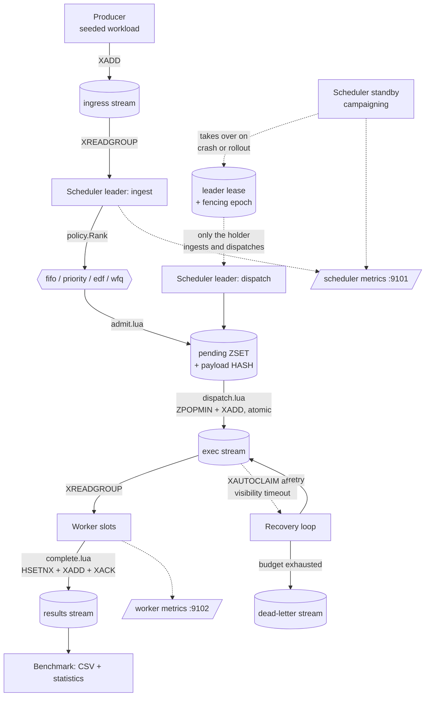
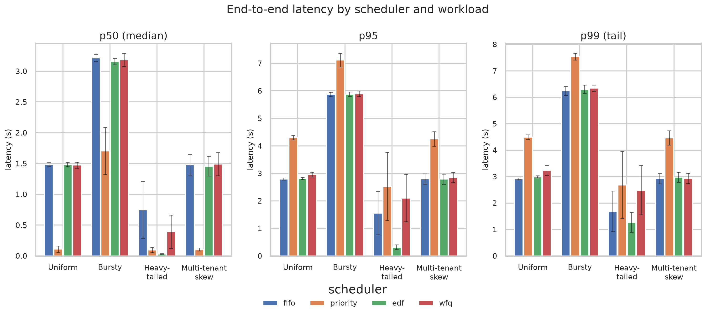
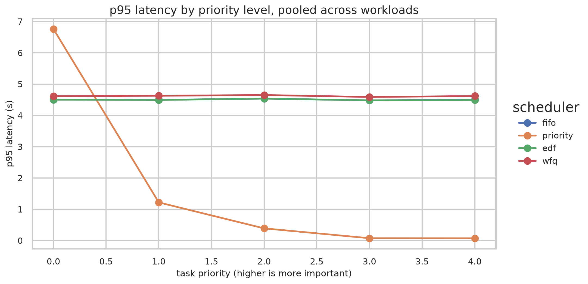
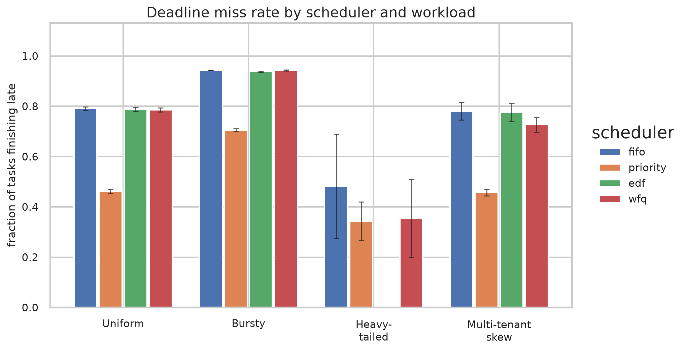
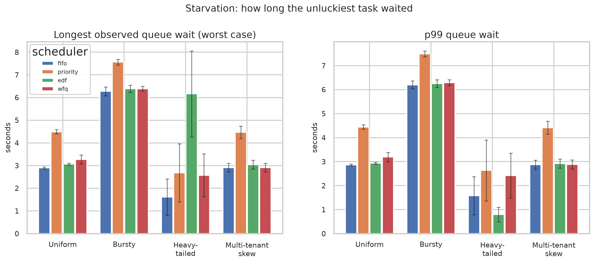
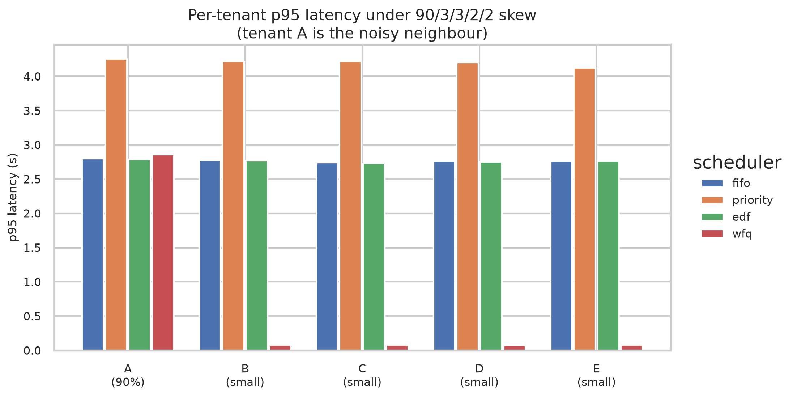
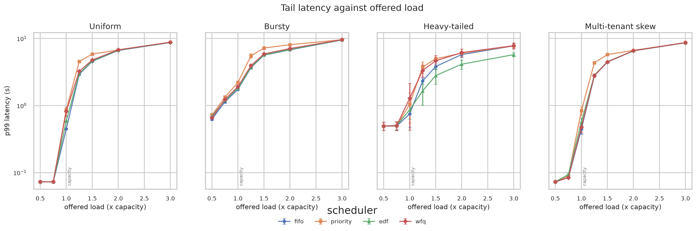
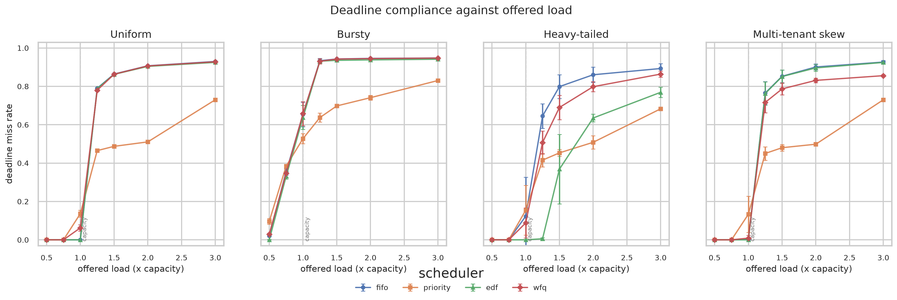
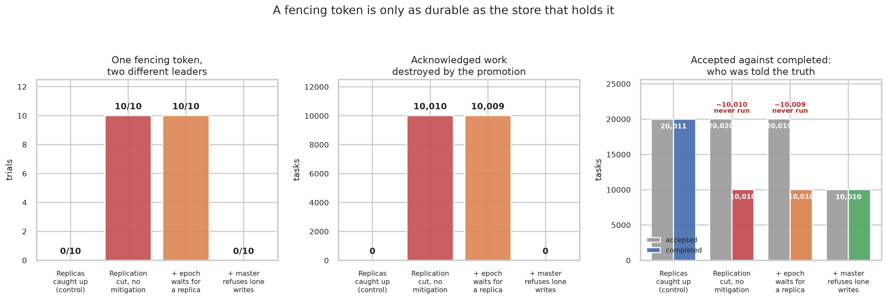
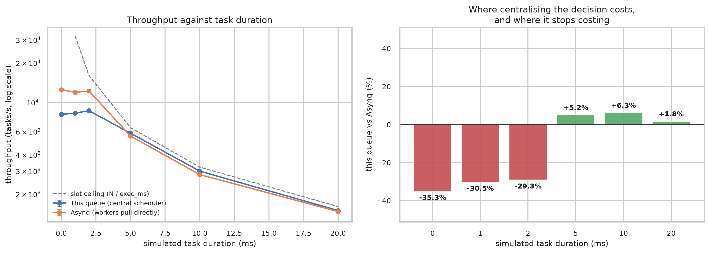

# Distributed Task Queue with Pluggable Scheduling

An experimental distributed task queue in which the **scheduling policy is a
first-class, swappable component**, built to measure how that choice affects
latency, throughput, deadline compliance, fairness and starvation under
controlled workloads.

Go 1.23+ · Redis 7+ Streams · Prometheus · Docker Compose · kind · Python analysis

---

## The research question

> How does the choice of scheduling policy affect latency, throughput, deadline
> compliance, fairness and starvation in a distributed task queue under
> different workload distributions?

Most task queues hard-code one queue discipline, almost always arrival order.
This project makes the discipline pluggable, puts a **real central scheduler**
between producers and workers, and runs a 4 x 4 matrix of schedulers against
workloads so that the trade-offs can be measured rather than asserted.

The contribution is empirical, not algorithmic: these are four well-known
policies, compared carefully under controlled conditions.

**Four schedulers** — `fifo`, `priority`, `edf`, `wfq`
**Four workloads** — `uniform`, `bursty`, `heavy_tailed`, `multi_tenant`
**16 primary experiments**, repeatable with controlled seeds.

---

## Architecture



<details>
<summary>ASCII version</summary>

```text
  Producer
     |  XADD
     v
  ingress stream --- XREADGROUP (group: schedulers) --> Scheduler LEADER
                                                            |
                                                     policy.Rank(task)
                                                            |  admit.lua (atomic)
                                                            v
                                                  pending ZSET + payload HASH
                                                            |
                                           dispatch.lua: ZPOPMIN + XADD (atomic)
                                                            v
  exec stream --- XREADGROUP (group: workers) --> Worker slots (simulated work)
        ^                                                   |
        |                                      complete.lua: HSETNX + XADD + XACK
        |  XAUTOCLAIM after visibility timeout              v
        +--------------- Recovery loop                results stream
                             |
                             +-- budget exhausted --> dead-letter stream


  Leadership, off to the side of the data path:

      Scheduler LEADER  ---- holds ----> leader lease (SET NX PX, TTL)
                                              |  grant carries epoch N
                                              v
                                         fence key: highest epoch that wrote
                                              ^
      Scheduler STANDBY ---- campaigns --------+
        (ready, scraped, dispatches nothing)

  Only the lease holder ingests and dispatches, and every write it makes
  carries epoch N. A write with an epoch below the fence is refused inside
  the same Lua script that would have performed it, so a leader that was
  paused past its TTL cannot act even if it still believes it leads.
```
</details>

The scheduler is a genuine decision point, not an emergent property of consumer
order. Producers write only to the ingress stream; workers only ever see tasks
the scheduler has already ranked and dispatched.

It is also a single writer, and that invariant is enforced by a Redis lease with
a monotonic fencing token rather than by a `replicas: 1` in a manifest. Run as
many scheduler replicas as you like: exactly one dispatches, the rest stand by,
and a superseded leader is refused **at the resource**, so a process that was
paused past its lease and woke up believing it still leads cannot act on that
belief. See [Scheduler failover](#scheduler-failover) and
[docs/architecture.md](docs/architecture.md).

---

## Prerequisites

| Requirement | Version | Needed for |
| --- | --- | --- |
| Go | 1.23 or newer | building and running everything |
| Redis | 7.0 or newer | the broker; `XAUTOCLAIM` requires 6.2+, streams behaviour is tested against 7 |
| Docker + Compose v2 | any recent | `make up`, `make redis-up`, image builds |
| Python | 3.9 or newer | analysis and plots |
| kind | 0.20+ | local Kubernetes deployment (optional) |
| kubectl | 1.27+ | local Kubernetes deployment (optional) |
| GNU Make | any | the workflows below |

No cloud account is required. Nothing outside these tools is needed.

Redis can be your own local install, a container, or a remote server via
`--redis-addr`.

---

## One-command start

```bash
make up
```

That builds the image and starts Redis, one scheduler, two workers and
Prometheus. Then submit work and watch it drain:

```bash
make submit                 # producer submits 500 uniform tasks
make status                 # queue depth, counters, per-tenant service
open http://localhost:9090  # Prometheus
```

Switch the scheduling policy without touching producers or workers:

```bash
SCHEDULER=wfq make up
```

Tear down:

```bash
make down
```

### Without Docker

```bash
redis-server --port 6379 &            # or: make redis-up
make build

./bin/scheduler --policy=wfq &
./bin/worker --concurrency=4 &
./bin/producer --workload=multi_tenant --count=500
./bin/tqctl status
```

---

## Exact commands

Every workflow has a Make target; `make help` lists them all. The underlying
commands are shown so nothing is hidden behind the Makefile.

### Producer

```bash
make run-producer WORKLOAD=bursty COUNT=1000 SEED=42

go run ./cmd/producer --config configs/default.yaml \
  --workload heavy_tailed --count 2000 --seed 7 --rate 300
go run ./cmd/producer --workload multi_tenant --count 500 --dry-run   # generate only
go run ./cmd/producer --workload uniform --count 500 --id-prefix batch2
```

> **Task IDs are deterministic.** They are a function of the seed and
> `id_prefix`, which is exactly what makes a run reproducible. The flip side is
> that submitting the same seed and prefix twice into the same namespace
> regenerates the same IDs, and the scheduler's admission guard correctly
> rejects the repeats — they show up in `tq_duplicate_admissions_total`. The
> producer checks up front and warns with the fix: use a different
> `--id-prefix` or `--seed`, or clear the namespace with `tqctl reset --yes`.

### Scheduler

```bash
make run-scheduler SCHEDULER=edf

go run ./cmd/scheduler --config configs/default.yaml \
  --policy wfq --metrics-addr :9101 --max-in-flight 32
go run ./cmd/scheduler --policy fifo --recovery=false   # recovery loop off

# Run a standby. It campaigns for the lease and dispatches nothing until the
# leader goes away, so starting one is always safe.
go run ./cmd/scheduler --policy wfq --metrics-addr :9111 --consumer sched-b

# Who is leading right now?
curl -s localhost:9101/metrics | grep tq_scheduler_is_leader
curl -s localhost:9111/metrics | grep tq_scheduler_is_leader

# Shorten failover at the cost of tolerating less latency before deposing a
# healthy leader. The renew interval must stay well below the TTL.
go run ./cmd/scheduler --lease-ttl 2s --lease-renew 600ms
```

### Worker

```bash
make run-worker CONCURRENCY=8

go run ./cmd/worker --config configs/default.yaml \
  --concurrency 8 --metrics-addr :9102
# scale out by starting more processes; each is its own consumer
go run ./cmd/worker --name worker-b --metrics-addr :9103
```

### Recovery and failure injection

The recovery loop runs inside the scheduler process and is on by default.

```bash
# a worker that abandons 30% of tasks after executing, before acknowledging
make run-worker-flaky
go run ./cmd/worker --fail-before-ack-rate 0.3 --fail-rate 0.05 --name flaky

make dlq          # inspect what could not be recovered
make status       # watch tq retries and unacked deliveries
```

### Metrics

```bash
curl -s localhost:9101/metrics | grep '^tq_'    # scheduler
curl -s localhost:9102/metrics | grep '^tq_'    # workers
curl -s localhost:9101/readyz                   # readiness probe
make metrics
```

### Tests

```bash
make test               # unit tests, race detector, no external services
make test-integration   # integration tests against a real Redis
make test-all           # both
make check              # gofmt + go vet + unit tests
make verify             # the above plus integration tests
make cover              # unit-test coverage summary
make cover-all          # combined unit + integration coverage
```

Integration tests are behind the `integration` build tag, so `go test ./...`
never needs Redis. They pick up `TQ_TEST_REDIS_ADDR`, defaulting to
`localhost:6379`, and each test uses its own randomly named key namespace which
it deletes afterwards, so running them against a shared development Redis is
safe.

### Benchmark matrix

```bash
make bench-quick                          # all 16 experiments, a couple of minutes
make bench-full REPETITIONS=5             # longer runs, reportable
make bench-failure                        # with 20% pre-ack failures
make bench-one SCHEDULER=wfq WORKLOAD=multi_tenant

go run ./cmd/benchmark \
  --config experiments/full.yaml \
  --schedulers fifo,priority,edf,wfq \
  --workloads uniform,bursty,heavy_tailed,multi_tenant \
  --repetitions 5 --workers 4 --concurrency 4 \
  --run-id my-experiment --results-dir results
```

### Measuring the scheduler itself

The matrix above is bounded by simulated work, so it says nothing about the
scheduler's own limits. Two separate tools do:

```bash
make ceiling TASKS=20000        # dispatch ceiling, no workers attached
make failover REPETITIONS=15    # dispatch outage when the leader is killed

# What does enforcing the single-writer invariant cost? Same measurement, twice.
go run ./cmd/schedbench --tasks 20000 --epoch 0    # fencing guard inert
go run ./cmd/schedbench --tasks 20000 --epoch 1    # fencing guard live

# Failover against a shorter lease: faster recovery, less tolerance for a
# latency spike before a healthy leader is deposed.
go run ./cmd/failoverbench --arms crash --lease-ttl 2s --lease-renew 600ms \
  --repetitions 12 --run-id failover-ttl2s
```

### Plots

```bash
make python-deps        # one-time: creates .venv with pandas, matplotlib, seaborn
make plots              # charts for the newest run
make plots RUN=my-experiment

python3 scripts/plot_results.py --results-dir results --run my-experiment --format png,svg

make sweep-plots RUN=sweep-loads          # offered-load curves
make failover-plots RUN=failover          # failover outage by arm
```

### Local Kubernetes with kind

```bash
make kind-up                       # create cluster, build image, load, deploy
make kind-submit                   # run the producer Job
make kind-scale WORKER_REPLICAS=6  # scale workers horizontally
make kind-status                   # queue state from inside the cluster
make kind-dlq                      # dead letters from inside the cluster
make kind-metrics                  # port-forward scheduler metrics to :9101
make kind-prometheus               # port-forward Prometheus to :9090
make kind-up-wfq                   # deploy the weighted-fair-queuing overlay
make kind-down                     # delete only this project's cluster
```

Raw equivalents:

```bash
scripts/kind-up.sh --cluster taskqueue --workers 4
kubectl --context kind-taskqueue -n taskqueue scale deployment/worker --replicas=6
kubectl --context kind-taskqueue -n taskqueue exec deploy/scheduler -- \
  tqctl dlq --config /etc/taskqueue/config.yaml
scripts/kind-down.sh --cluster taskqueue
```

`kind-down.sh` deletes only the named cluster; other kind clusters are untouched.

The scheduler Deployment runs **two replicas with a RollingUpdate strategy and a
PodDisruptionBudget**, which is only safe because the lease enforces one
dispatcher. Watch a failover from inside the cluster:

```bash
kubectl --context kind-taskqueue -n taskqueue exec deploy/scheduler -- \
  tqctl status --config /etc/taskqueue/config.yaml | grep leader

# Kill the leader by name and watch the standby take it over within the TTL.
kubectl --context kind-taskqueue -n taskqueue delete pod <leader-pod> --force
```

A single-node kind cluster cannot spread the two replicas across nodes, so the
topology-spread constraint is `ScheduleAnyway` rather than a hard requirement —
a hard one would leave the standby permanently pending in exactly the
environment this README tells you to try first.

### Scaling workers horizontally

```bash
docker compose up -d --scale worker=6                                  # Compose
kubectl -n taskqueue scale deployment/worker --replicas=6              # Kubernetes
go run ./cmd/worker --name worker-c --metrics-addr :9104               # bare process
```

Workers are stateless consumers of one Redis Streams consumer group, so they
scale without coordination.

**Schedulers scale for availability, not throughput.** Exactly one replica holds
the lease and dispatches; the rest stand by. Adding replicas shortens the outage
after a crash and makes rollouts free, but it does not raise scheduling
capacity, because the single-writer invariant is the whole point rather than an
implementation limit. The ceiling is [measured
here](#how-fast-is-the-scheduler-itself); at roughly 3% utilisation in these
experiments, it is a long way from being the constraint.

```bash
kubectl -n taskqueue scale deployment/scheduler --replicas=3            # safe
kubectl -n taskqueue get pods -l app.kubernetes.io/name=scheduler       # 1 leads
```

Before the lease existed this said "the scheduler is deliberately
single-replica", and that command would have silently corrupted WFQ.

---

## Configuration reference

Configuration is YAML, with flags overriding file values and a handful of
environment variables (`TQ_CONFIG`, `TQ_REDIS_ADDR`, `TQ_NAMESPACE`,
`TQ_LOG_LEVEL`, `TQ_LOG_FORMAT`) overriding nothing but supplying defaults.
Everything is validated at startup; a misconfigured process exits with a
message naming the offending field rather than running incorrectly.

Every duration is a Go duration string with explicit units (`250ms`, `2s`,
`1m30s`). Every field ending in `_ms` is an integer count of milliseconds.
There are no ambiguous time units anywhere.

Shipped files: `configs/default.yaml` (fully commented), `configs/priority.yaml`,
`configs/edf.yaml`, `configs/wfq.yaml`, `configs/docker.yaml`, plus the
experiment profiles in `experiments/`.

### `redis`

| Field | Default | Meaning |
| --- | --- | --- |
| `addr` | `localhost:6379` | Broker address. |
| `password` | `""` | Redis password. |
| `db` | `0` | Database number. |
| `dial_timeout` / `read_timeout` / `write_timeout` | `5s` / `3s` / `3s` | Connection timeouts. |
| `pool_size` | `32` | Connection pool size. Must exceed the number of blocking consumers. |

### `streams`

| Field | Default | Meaning |
| --- | --- | --- |
| `namespace` | `tq` | Prefix for every Redis key. Independent experiments can share one Redis. |
| `ingress_stream` | `ingress` | Producer to scheduler. |
| `exec_stream` | `exec` | Scheduler to workers. |
| `results_stream` | `results` | Terminal task records. |
| `dead_letter_stream` | `dead` | Tasks that exhausted their retry budget. |
| `scheduler_group` | `schedulers` | Consumer group on the ingress stream. |
| `worker_group` | `workers` | Consumer group on the execution stream. |
| `max_len` | `0` | Approximate stream trim length. `0` disables trimming, which is what experiments want. |

### `scheduler`

| Field | Default | Meaning |
| --- | --- | --- |
| `policy` | `fifo` | `fifo`, `priority`, `edf` or `wfq`. |
| `ingest_batch` | `256` | Ingress entries read per call. |
| `ingest_block` | `200ms` | How long `XREADGROUP` blocks on the ingress stream. |
| `dispatch_batch` | `32` | Tasks dispatched per loop pass. |
| `idle_sleep` | `2ms` | Back-off when there is nothing to dispatch. Must be positive; this is what stops a busy loop. |
| `max_in_flight` | `64` | Cap on dispatched-but-unfinished tasks. `0` is unlimited. **Set this close to the total worker slot count**, or the execution stream becomes the real queue and every policy degrades to arrival order. |
| `metrics_addr` | `:9101` | Prometheus listen address. Empty disables the endpoint. |
| `tenant_weights` | all `1` | Relative WFQ weights per tenant. Ignored by other policies. |
| `default_tenant_weight` | `1` | Weight for tenants absent from the map. |
| `state_flush_interval` | `1s` | How often policy state is persisted to Redis. |
| `leader_election.enabled` | `true` | Enforce one dispatching scheduler through a Redis lease. Turning this off is only safe if something outside the system guarantees a single scheduler. |
| `leader_election.ttl` | `5s` | How long a grant survives without renewal, and therefore the dispatch outage after a hard crash. A clean shutdown releases the lease and costs nothing, so this governs crashes only. |
| `leader_election.renew_interval` | `1500ms` | How often the leader extends its grant. Must be shorter than the TTL; at this ratio the leader gets three attempts to ride out a slow Redis round trip. |
| `leader_election.retry_interval` | `1s` | How often a standby retries acquisition. This, not the TTL, is what bounds a **graceful** handover: the outgoing leader releases the lease immediately, and the standby then takes up to one retry interval to notice. Lower it to shorten rollout gaps, at the cost of one Redis round trip per standby per interval. |
| `ingest_reclaim_interval` | `1s` | How often the leader looks for ingress entries stranded by a scheduler that died mid-batch. |
| `ingest_reclaim_min_idle` | `2s` | How long an ingress entry must be pending before it counts as stranded. Far below `recovery.min_idle`, deliberately: a worker legitimately holds an exec entry for as long as the task runs, while a scheduler holds an ingress entry for microseconds. |

`leader_election.enabled` is the one boolean whose default is not backfilled from
the built-in config. A bool's zero value is indistinguishable from an explicit
`false`, so backfilling it would silently re-enable election for anyone who had
turned it off. Omitting the block entirely still leaves it on, because loading
starts from the defaults and decodes over them.

### `worker`

| Field | Default | Meaning |
| --- | --- | --- |
| `name` | `""` | Consumer name prefix; empty derives `hostname-pid`. |
| `concurrency` | `4` | Parallel execution slots. |
| `block` | `500ms` | How long `XREADGROUP` blocks on the execution stream. |
| `metrics_addr` | `:9102` | Prometheus listen address. |
| `fail_before_ack_rate` | `0.0` | Probability of abandoning a task after executing and before acknowledging, simulating a crash. |
| `fail_rate` | `0.0` | Probability of reporting an application error. |
| `fail_seed` | `0` | Makes injected failures reproducible; `0` derives a seed from the worker name. |
| `shutdown_grace` | `15s` | How long in-flight work may run after shutdown begins. |

### `recovery`

| Field | Default | Meaning |
| --- | --- | --- |
| `enabled` | `true` | Runs the recovery loop inside the scheduler process. |
| `interval` | `500ms` | How often `XAUTOCLAIM` runs. |
| `min_idle` | `10s` | **Visibility timeout.** How long a delivered-but-unacknowledged entry may sit before it is reclaimed. Must exceed your longest task, or healthy work gets duplicated. |
| `batch` | `128` | Maximum entries reclaimed per pass. |
| `max_retries` | `3` | Retry budget for tasks whose payload carries `max_retries: 0`. |

### `workload`

| Field | Default | Meaning |
| --- | --- | --- |
| `type` | `uniform` | `uniform`, `bursty`, `heavy_tailed`, `multi_tenant`. |
| `seed` | `42` | Fixes the pseudo-random stream. |
| `count` | `500` | Total tasks. The workload is finite so benchmarks terminate. |
| `id_prefix` | `task` | Prefix for generated task IDs. |
| `arrival_rate_per_sec` | `120` | Mean arrival rate. |
| `max_retries` | `3` | Stamped onto every generated task. |
| `exec.min_ms` / `exec.max_ms` | `40` / `60` | Uniform duration bounds. |
| `priority.weights` | `[40,25,20,10,5]` | Relative frequency of priority 0..n; higher index is more important. |
| `deadline.base_ms` | `250` | Fixed slack. |
| `deadline.exec_multiplier` | `3` | Slack proportional to the task's own duration. |
| `deadline.jitter_ms` | `250` | Uniform random extra slack. |
| `tenants` | five at 0.2 | Tenant shares for non-skewed workloads. Must sum to 1. |
| `skew_tenants` | 90/3/3/2/2 | Tenant shares used when `type: multi_tenant`. |
| `burst.*` | see file | Base rate, burst rate, burst duration and period. |
| `heavy_tail.min_ms` / `max_ms` / `alpha` | `15` / `4000` / `1.3` | Pareto parameters; smaller alpha means a heavier tail. |

### `log`

| Field | Default | Meaning |
| --- | --- | --- |
| `level` | `info` | `debug`, `info`, `warn`, `error`. |
| `format` | `text` | `text` or `json`. |

---

## Scheduling algorithms

All four implement one interface. A policy converts a task into an ordering key,
and the machinery always dispatches the smallest key first:

```go
type Key struct {
    Score  float64 // lower dispatches first
    Member string  // "<zero-padded submit millis>|<task id>", the tie-break
}
```

Redis sorted sets order equal-score members lexicographically by byte value,
which is exactly Go string comparison. That means the in-memory queue used by
the unit tests and the `ZPOPMIN` used in production **cannot disagree**: the
ordering asserted in the tests is the ordering the deployed system produces.
An integration test checks this against a real Redis.

### `fifo` — first in, first out

Score is the submission time in Unix milliseconds. Ties break by task ID.

The experimental baseline. No knowledge of priority, deadlines, task size or
tenants.

*Caveats.* Under a heavy-tailed workload a single long task blocks everything
behind it (head-of-line blocking). Under tenant skew a dominant tenant's backlog
delays every small tenant equally, which looks fair but is exactly the
noisy-neighbour failure.

### `priority` — strict priority

Higher numeric priority first; ties break by submission time, then task ID.

Priority and submission time are packed into one float64 score as
`(255 - priority) * 1e13 + submitted_millis`. Unix milliseconds stay below 1e13
until the year 2286, so a submission time can never leak into the next priority
band, and the largest possible score is well inside the range where float64
represents integers exactly.

*Caveats.* **Deliberately starvation-prone.** There is no ageing: a sustained
stream of high-priority work can hold low-priority tasks back indefinitely. That
is the point — the experiments measure the effect rather than hiding it. Expect
the best p50 of the four and the worst p99 and maximum wait. Priorities are
clamped to `[0, 255]`.

### `edf` — earliest deadline first

Score is the absolute deadline in Unix milliseconds; ties break by submission
time, then task ID. Tasks with no deadline sort after every task that has one.

*Caveats.* EDF is optimal for uniprocessor scheduling only when the system is
**not** overloaded, and classical theory warns it can degrade badly beyond that
by preferring already-doomed tasks. **That pathology did not appear here.**
Across a 0.5x to 3x load sweep EDF had the lowest deadline miss rate at every
level, its advantage narrowing rather than inverting, because these deadlines
are generous and scale with each task's own duration. What EDF does pay is
starvation: its longest wait is several times FIFO's, since it defers precisely
the large tasks whose deadlines are furthest away. EDF also ignores priority
entirely.

### `wfq` — weighted fair queuing

Per-tenant fairness using **self-clocked fair queuing (SCFQ)** virtual finish
times.

On admission of task `t` from tenant `k` with weight `w_k`:

```
start_t  = max(virtualTime, lastFinish[k])
finish_t = start_t + cost(t) / w_k
lastFinish[k] = finish_t
order t by finish_t
```

On dispatch of a task with virtual finish `f`:

```
virtualTime = max(virtualTime, f)
```

`cost(t)` is the task's simulated duration in milliseconds. Dividing by the
tenant weight means a tenant with weight 5 advances its virtual clock five times
more slowly per unit of work, so it receives roughly five times the service.
Because a newly active tenant starts at `max(virtualTime, lastFinish)`, an idle
tenant cannot bank credit and then flood the queue, and a backlogged tenant
cannot run ahead of virtual time. **That is the mechanism that stops a dominant
tenant from consuming all capacity**, and it is asserted directly in
`TestDominantTenantCannotStarveOthers` and
`TestFIFOStarvesSmallTenantWhereWFQDoesNot`.

*Approximations, stated explicitly.*

1. Virtual time advances on **dispatch events** (SCFQ) rather than by emulating
   a GPS fluid server. This is cheaper and needs no per-packet simulation, at
   the cost of a larger worst-case delay bound than WF2Q.
2. Scheduling is **non-preemptive at whole-task granularity**. Once dispatched,
   a task runs to completion, so fairness is only approximate over horizons
   shorter than the largest task. This matters most on the heavy-tailed workload.
3. `cost(t)` uses the task's **declared** duration, which this system knows
   exactly. A production scheduler would have to estimate it, and estimation
   error degrades fairness. These results are therefore an upper bound on WFQ's
   achievable fairness.
4. Ordering is over the whole pending set rather than per-tenant sub-queues.
   Since virtual finish times within one tenant increase monotonically by
   construction, per-tenant FIFO order is preserved anyway.

WFQ is also the only stateful policy: its virtual clock and per-tenant finish
tags are persisted to Redis and restored on restart.

---

## Delivery semantics and idempotency

**The queue provides at-least-once delivery. It does not provide exactly-once
delivery and does not claim to.**

A task may execute more than once. This happens whenever a worker executes a
task and then dies, is killed, or loses its connection before acknowledging: the
entry stays in the consumer group's pending entries list, the recovery loop
reclaims it after the visibility timeout, and another worker runs it again.

What is guaranteed instead:

> **Completion is recorded exactly once per task ID.** However many times a task
> body executes, exactly one result record is written to the results stream,
> exactly one completion is counted, and tenant service accounting is
> incremented exactly once.

The guarantee is enforced by a single `HSETNX` on a Redis hash of completed task
IDs, inside the same atomic Lua script that writes the result record, updates
the counters and acknowledges the delivery. A second completion for the same
task ID finds the key present, writes nothing, increments
`tq_duplicate_completions_total`, and still acknowledges the redundant delivery.
Since the guard, the result write and the acknowledgement are one atomic unit,
there is no window in which a result is recorded but the acknowledgement is
lost, or vice versa.

The precise scope of the guarantee:

| Property | Guaranteed? |
| --- | --- |
| Every submitted task eventually reaches a terminal state (completed or dead-lettered) | Yes, given a retry budget and a live worker |
| A task body executes at most once | **No.** Duplicate execution is expected under failure. |
| A task's completion is recorded at most once | **Yes**, keyed by task ID |
| A task's completion is recorded at least once, given it completes | **Yes** |
| Tenant service accounting counts a task once | **Yes** |
| No task is lost between selection and dispatch | **Yes**, `ZPOPMIN` and `XADD` are one atomic script |
| A redelivered ingress entry creates a duplicate pending task | **No**, admission is guarded by the same completed/pending check |
| Ordering across concurrent workers | **No.** Dispatch order is exact; completion order is not, since workers run in parallel. |

The practical consequence for anyone extending this with real work: **task
handlers must be idempotent.** The queue makes recording the outcome idempotent;
it cannot make an arbitrary side effect idempotent for you.

---

## Failure recovery and the dead-letter workflow

```text
task dispatched
      |
      v
worker executes
      |
      +-- acknowledged --------------------> completed (recorded once)
      |
      +-- application error ---------------> retry or dead-letter immediately
      |
      +-- worker dies before acknowledging
                |
                v
          entry sits in the consumer group PEL, idle time growing
                |
          idle > recovery.min_idle (visibility timeout)
                |
                v
          XAUTOCLAIM reclaims it
                |
                +-- retry_count < max_retries --> redelivered, retry_count += 1,
                |                                 new attempt_id
                |
                +-- budget exhausted -----------> dead-letter stream,
                                                  with failure metadata
```

Retry counts increment on the task payload itself and each retry gets a fresh
`attempt_id` while the `id` stays stable — the ID is what idempotency keys on,
the attempt ID is what makes individual deliveries traceable.

A dead-letter record carries the full task, the failure reason, the attempt
count, the last attempt ID and the failure timestamp.

### Inspecting dead letters

```bash
make dlq
go run ./cmd/tqctl dlq --limit 100
go run ./cmd/tqctl dlq --json | jq '.[] | {id: .task.id, reason: .reason, attempts: .attempts}'

# from inside a Kubernetes deployment
kubectl -n taskqueue exec deploy/scheduler -- tqctl dlq --config /etc/taskqueue/config.yaml

# straight from Redis, if you prefer
redis-cli XRANGE tq:stream:dead - + COUNT 10
redis-cli XLEN tq:stream:dead
```

The benchmark harness also writes
`results/<run>/dead_letters/<scheduler>_<workload>_rep<N>.json` whenever an
experiment produced any.

### Testing the recovery path

```bash
go run ./cmd/worker --fail-before-ack-rate 0.3     # 30% of attempts abandoned
make bench-failure                                 # matrix with 20% failures
```

Setting `recovery.min_idle` is a real trade-off, not a value to minimise: too
short and healthy slow tasks get duplicated; too long and genuine failures take
a long time to recover. It must exceed your longest expected task duration.

---

## Scheduler failover

The scheduler is the interesting component in this system and it is a single
writer. That is not an implementation shortcut: the policy's virtual clock lives
partly in memory, so two schedulers ranking the same stream each advance their
own copy against roughly half the traffic, then flush to the same hash where the
later write wins. Nothing errors, no counter moves, and the only symptom is that
the fairness numbers are quietly wrong.

So "exactly one scheduler dispatches" has to be a property of the system, not of
the deployment manifest.

### The lease and the fence

`<ns>:leader` is held with `SET NX PX`, renewed about three times per TTL, and
released on clean shutdown. Each grant carries an **epoch**, a counter INCRed
once per grant inside the same atomic script.

The epoch is the part that matters, and it is worth being explicit about why the
lease alone is not enough. A leader can lose its lease without knowing: a
garbage-collection pause, a suspended container, or a partition that outlasts
the TTL. Redis expires the key, a standby wins the next grant, and only then
does the old leader resume, still believing it leads. Careful renewal does not
close that window, because the old leader is not running during it, and
cancelling its context cannot help for the same reason.

The epoch therefore travels with every write the leader makes, and the check
lives **at the resource**:

```lua
if epoch < fence then return redis.error_reply('TQFENCED ...') end
if epoch > fence then redis.call('SET', fenceKey, epoch) end
```

Redis remembers the highest epoch that has successfully written; anything lower
is refused permanently, from the instant the successor makes its first write.

Three operations are guarded, for three different reasons:

| operation | what an unguarded stale leader would do |
| --- | --- |
| `dispatch` | hand workers real tasks chosen by an out-of-date virtual clock — work that is already running by the time anyone notices |
| `admit` | insert tasks into the pending set at *scores* derived from a clock it no longer owns; the score is not a property of the task, it is produced by the policy |
| policy-state flush | the silent one. The write always succeeds, and afterwards only the fairness is wrong |

Guarding admission is the one that is easy to miss, and leaving it out would
have made the other two guards cosmetic.

Election off (`leader_election.enabled: false`) means a non-positive epoch, and
the guard then does nothing at all, so a single-scheduler deployment and the
benchmark harness take exactly the path they always did.

### Try it

```bash
make up                                  # two schedulers, one leads
make status                              # names the leader, its epoch and lease

# scheduler leader     <container-hostname>-1 (epoch 3, lease expires in 4.2s)

docker compose kill scheduler            # hard crash, nothing released
make status                              # the standby, at a strictly newer epoch
```

Which of the two wins the first grant is a race, and that is fine — the point
is that exactly one does.

`tqctl status` reads the lease key from Redis rather than asking a scheduler, so
it answers correctly even when the process that believes it leads is wedged or
unreachable. Per-replica truth is on the metrics endpoints:

```bash
curl -s localhost:9101/metrics | grep tq_scheduler_is_leader   # one of these
curl -s localhost:9103/metrics | grep tq_scheduler_is_leader   # reports 1
```

The one expression worth alerting on covers both failure directions at once:

```promql
sum(tq_scheduler_is_leader) != 1    # 0 = leaderless, 2 = split brain
```

This is also why a standby's readiness probe passes. An unready pod is dropped
from the Service, which would stop Prometheus scraping the very metric that
tells you who leads, and a Deployment whose spare replica is never ready cannot
complete a rolling update.

### What a promoted standby has to do

Taking over is more than starting to dispatch.

**Reload policy state.** Done at the start of every term rather than once at
process start, so a standby promoted an hour after it booted adopts the virtual
clock as the previous leader left it instead of resetting it to zero and
re-granting service to whichever tenant was already ahead.

**Reclaim stranded ingress entries.** `XREADGROUP` with `>` only ever delivers
entries nobody has seen. An entry the dead leader read and never acknowledged
belongs to a consumer name that will never come back, so no successor is offered
it again. The task was accepted from the producer's point of view and then never
scheduled: not pending, not in flight, not dead-lettered, counted nowhere.

That one was found rather than anticipated. The failover experiment below
reported exactly one unfinished task in every killed-leader trial, which is what
sent us looking. The leader now runs `XAUTOCLAIM` over the ingress group and
re-admits what it finds, which is safe because admission is idempotent, and the
same trials now complete all 4,000 tasks.

The recovery loop, by contrast, runs on **every** replica. Its paths are already
idempotent, and making it leader-only would mean a leader wedged mid-term stops
the queue healing itself, which is the one situation recovery exists for.

### Measured, not asserted

`cmd/failoverbench` starts real scheduler processes, kills one with a real
signal, and measures the resulting dispatch gap from the `dispatched_at_ms`
stamp the dispatch script writes on every execution-stream entry. The outage is
defined without wiggle room: the time between the last dispatch at or before the
kill and the first one after it.

```bash
make failover REPETITIONS=15
make failover-plots RUN=failover
```

Five arms, each answering a different question:

| Arm | What happens to the leader | Question |
| --- | --- | --- |
| `none` | nothing | What is the natural gap between dispatches? Every other number is read against this. |
| `graceful` | `SIGTERM` | What does a rollout cost? The lease is released. |
| `crash` | `SIGKILL` | What does a crash cost? Nothing is released, so the TTL has to expire. |
| `single` | `SIGKILL`, one replica | What is the lease actually buying? |
| `pause` | `SIGSTOP` past the lease, then `SIGCONT` | What is the *fence* buying? |

The last arm is the one that loads the fencing token. The other four kill the
leader, and a lease on its own would have handled every one of them, because a
dead process writes nothing. A leader that was merely *frozen* comes back still
believing it leads, and nothing inside that process can tell it otherwise — it
was not running to be told. That is the case the fence exists for, and a clean
`SIGKILL` cannot produce it.

Every execution-stream entry is stamped with the epoch that dispatched it, so
the invariant is checked against the dispatch log rather than against a counter:
replay the stream and the epochs must never go backwards. Removing the fence
makes the violation appear immediately — 172 of 400 entries dispatched under a
dead term — which is how the check was shown to have teeth.

Results: [Failover and the cost of a crash](#failover-and-the-cost-of-a-crash)
and [The failure the fence is for](#the-failure-the-fence-is-for), or sections
4.7 and 4.8 of the [report](docs/report.md).

---

## Metrics

Scheduler on `:9101/metrics`, workers on `:9102/metrics`, both also serving
`/healthz` and `/readyz`.

The only dynamic label is `tenant`, from a small configured set. **Task IDs,
attempt IDs and worker names are never used as labels.** Constant labels
`component` and `scheduler` identify the process and the active policy. A
process exposes only the metrics it can produce, so nothing is reported as
permanently zero, and every tenant series is pre-created at zero so a starved
tenant is visible rather than missing.

Headline metrics:

| Metric | Type | Measures |
| --- | --- | --- |
| `tq_queue_wait_seconds` | histogram | submission to start of execution |
| `tq_task_latency_seconds` | histogram | submission to terminal completion |
| `tq_task_exec_seconds` | histogram | measured execution time |
| `tq_tasks_completed_total{tenant}` | counter | throughput |
| `tq_deadline_missed_total{tenant}` | counter | deadline misses |
| `tq_pending_tasks` | gauge | queue depth |
| `tq_max_observed_wait_seconds` | gauge | **starvation indicator** |
| `tq_worker_busy_seconds_total` / `tq_worker_slot_seconds_total` | counters | utilisation |
| `tq_tenant_service_seconds_total{tenant}` | counter | **the `x` vector of Jain's index** |
| `tq_task_retries_total` / `tq_tasks_dead_lettered_total` | counters | failure handling |
| `tq_duplicate_completions_total` | counter | duplicate delivery, correctly suppressed |
| `tq_scheduler_is_leader` | gauge | **which replica is dispatching**; alert on `sum(...) != 1` |
| `tq_scheduler_leader_transitions_total` | counter | failovers (two per handover: one loss, one acquisition) |
| `tq_scheduler_fenced_operations_total` | counter | writes refused from a superseded leader |
| `tq_ingress_reclaimed_total` | counter | tasks rescued from a scheduler that died mid-batch |

Full reference, including PromQL examples: [docs/metrics.md](docs/metrics.md).

---

## Benchmark methodology

Each of the 16 cells runs in its **own Redis key namespace**
(`bench-<run id>-<scheduler>-<workload>-r<rep>`), reset before and deleted
after. Every CSV row also repeats the full run identity. Mixing results from
different runs is therefore not possible by accident.

For one experiment the harness starts a scheduler, a recovery loop and N workers
in-process, waits for readiness, replays the seeded workload with correct arrival
pacing, polls until every task is terminal or the timeout expires, shuts
everything down, and reads the task-level records back from the results stream.

### Load level matters

A scheduler can only matter when a queue exists. Service capacity is
approximately `workers x concurrency / mean_exec_seconds`. Both shipped profiles
target a sustained overload of about **1.25x** capacity, and set
`max_in_flight` to the total slot count so the backlog stays in the scheduler's
pending set. If all four schedulers give you identical numbers, the run was
under-loaded.

### Statistics

- **Percentiles** use linear interpolation between the two closest ranks, the
  same definition numpy and pandas use, so the Go and Python numbers agree.
- **Throughput** is `completed / makespan`, where makespan spans the earliest
  submission to the latest completion, so tear-down time does not deflate it.
- **Deadline miss rate** is over completed tasks; finishing exactly on the
  deadline is a hit; dead-lettered tasks are excluded and reported separately.
- **Utilisation** is `busy_slot_seconds / (slots x experiment_duration)`.

### Jain's fairness index

```
J(x) = (sum(x))^2 / (n * sum(x^2))
```

**`x` is completed service seconds per tenant.** Tenants that received no
service are included as zeros — dropping them would report perfect fairness for
a queue that served exactly one tenant, which is the very failure the index
exists to catch. `J` lies in `[1/n, 1]`: 1 when all tenants received identical
service, `1/n` when one tenant took everything. An all-zero vector is reported
as 1 by convention, an empty vector as NaN. The same index over completed task
counts is reported as `jain_fairness_count`, because the two diverge when
tenants submit tasks of very different sizes.

### Reproducibility, and its limits

For a given seed and workload configuration, the generated task sequence is
**byte-identical** on any machine: same IDs, tenants, arrival offsets, durations,
priorities and deadline slacks. Every random value comes from one seeded
`math/rand` source consumed in a fixed order per task, and
`TestSameSeedProducesIdenticalSequence` asserts it for all four workload types.
Repetition *i* uses seed `base_seed + i`.

**Timing is not reproducible.** Latency, throughput and utilisation depend on
machine speed, Redis round-trip time and background load. So:

- Report repetitions, not single runs; `--repetitions 5` is a sensible minimum.
  The plotting script shows means with standard-deviation error bars and warns
  explicitly when there is only one repetition.
- Check `producer_max_lag_s`. If it is a large fraction of observed latencies,
  the load generator was the bottleneck, not the queue.
- Do not compare across machines, or across runs with different worker counts,
  concurrency or `max_in_flight`. All of these are recorded in every aggregate
  row precisely so mismatches are visible.
- A timed-out experiment is written with `timed_out=true` and describes a
  truncated run; do not compare it against completed ones.

Full detail: [docs/experiments.md](docs/experiments.md).

---

## Result directory layout

```
results/
└── <run id>/
    ├── aggregate.csv        one row per scheduler x workload x repetition
    ├── tenants.csv          one row per tenant per experiment
    ├── manifest.json        full config, seeds and every experiment summary
    ├── raw/
    │   └── <scheduler>_<workload>_rep<N>.csv     one row per completed task
    │                                             a --loads sweep inserts the load:
    │                                             <scheduler>_<workload>_l1p25_rep<N>.csv
    ├── dead_letters/
    │   └── <scheduler>_<workload>_rep<N>.json    only when non-empty
    └── plots/               produced by scripts/plot_results.py
        ├── latency_percentiles.{png,svg}
        ├── latency_tail_ratio.{png,svg}
        ├── throughput.{png,svg}
        ├── deadline_miss_rate.{png,svg}
        ├── jain_fairness.{png,svg}
        ├── starvation_max_wait.{png,svg}
        ├── worker_utilization.{png,svg}
        ├── tenant_latency_skew.{png,svg}
        ├── priority_starvation.{png,svg}
        └── summary_table.{csv,md}
```

Generated results are not committed. The single exception is
`results/example/`, a deliberately tiny trimmed run kept so the CSV schemas and
chart style are visible without running anything — see
[results/README.md](results/README.md). Its numbers are an illustration of the
output format, **not** a result to cite.

---

## How to interpret the results

**Tail latency.** Compare `latency_p99_s` against `latency_p50_s`; the
`latency_tail_ratio` chart plots that directly. A policy that improves the
median by deferring some population usually pays in the tail. Strict priority is
the clearest case: best p50, worst p99.

**Starvation.** Read `wait_max_s` and `priority_starvation.png`, which plots p95
latency against priority level. Under strict priority, low-priority tasks should
show visibly worse latency and the gap should widen with load. FIFO and WFQ
should show no priority gradient at all, since neither reads the priority field.
`tq_max_observed_wait_seconds` is the live equivalent.

**Deadline compliance.** EDF has the lowest miss rate at every load measured;
its advantage shrinks as load rises but does not invert. If EDF is not winning,
check whether the run was under-loaded (nobody misses) or so overloaded that
everybody misses. Always read the miss rate together with the maximum wait,
since EDF buys compliance with starvation, and with the dead-letter count, since
a run cannot look good by discarding work.

**Fairness.** Read `jain_fairness_service` **together with**
`tenant_latency_skew.png`, and understand why. Jain's index over completed
service is *demand-limited*: under the 90/3/3/2/2 skew, tenants B–E only submit
a few percent of the work, so no scheduler can give them a large share of
service, and every policy reports a similar index near `1/n`. That is a property
of the workload, not a failure of the scheduler.

What actually distinguishes the policies under skew is **per-tenant latency**. A
work-conserving fair queue protects a small tenant's latency even when it cannot
raise its share. In the measured run below, small-tenant p95 latency is 0.077 s
under WFQ versus ~2.7 s under FIFO, EDF and priority, while all four report a
Jain index of 0.246. Report both numbers; either alone is misleading.

**Throughput.** Expect all four to be close. Work-conserving schedulers do not
change how much work gets done, only who waits. A large throughput gap usually
means a configuration problem — a timed-out experiment, a dispatch bottleneck,
an under-loaded run — not a scheduling insight.

---

## Measured results

Four runs of the shipped `experiments/full.yaml` profile, 4000 tasks per
experiment:

| run | scope | experiments | tasks |
| --- | --- | ---: | ---: |
| `full-5rep` | full matrix, 5 repetitions | 80 | 320,000 |
| `heavy-25rep` | `heavy_tailed`, 25 repetitions | 100 | 400,000 |
| `stable-25rep` | `bursty` + `multi_tenant`, 25 repetitions | 200 | 800,000 |
| `uniform-25rep` | `uniform`, 25 repetitions | 100 | 400,000 |
| `final-25rep` | the three 25-repetition runs merged for analysis | 400 | — |

**480 experiments, 1.92 million tasks.** Every one completed every task. None
timed out, none were dead-lettered, and maximum producer lag across all four
runs was 87 ms, so the load generator was never the bottleneck.

The table below reports **25 repetitions for every cell**. See
[Repetitions matter](#repetitions-matter) for what the repetition count changed
and what it did not.

```bash
make bench-full REPETITIONS=5 RUN=full-5rep

go run ./cmd/benchmark --config experiments/full.yaml \
  --workloads heavy_tailed --repetitions 25 \
  --workers 4 --concurrency 4 --run-id heavy-25rep

go run ./cmd/benchmark --config experiments/full.yaml \
  --workloads bursty,multi_tenant --repetitions 25 \
  --workers 4 --concurrency 4 --run-id stable-25rep

go run ./cmd/benchmark --config experiments/full.yaml \
  --workloads uniform --repetitions 25 \
  --workers 4 --concurrency 4 --run-id uniform-25rep

# combine the three 25-repetition runs into one directory and chart the matrix
make merge OUT=final-25rep RUNS="uniform-25rep stable-25rep heavy-25rep"
make plots RUN=final-25rep
```

The matrix was filled in across three invocations because the workloads needed
different repetition counts. `scripts/merge_runs.py` combines them for analysis
and refuses to do so unless the runs agree on every configuration field that
affects results, or if any scheduler/workload/repetition cell appears twice.
Each row keeps the `run_id` of the run that produced it, so provenance survives
into the merged CSVs, and the merged manifest records it as an assembled view
rather than a single benchmark invocation. The charts referenced below come
from that merged directory.

Environment: macOS 26.6 on an Apple M5 (10 cores), Redis 8.10.1 on localhost,
4 worker processes x 4 slots = 16 slots, `max_in_flight=16`, arrivals at 400/s
against a service capacity of ~320/s (≈1.25x offered load). Values are means
across repetitions; the `reps` column says how many. **These numbers describe
this machine under this configuration; do not port them elsewhere.**

| workload | scheduler | p50 s | p95 s | p99 s | max wait s | deadline miss | tasks/s | util | Jain |
| --- | --- | ---: | ---: | ---: | ---: | ---: | ---: | ---: | ---: |
| uniform | fifo | 1.486 | 2.796 | 2.917 | 2.900 | 0.791 | 308.8 | 0.96 | 0.999 |
| uniform | priority | 0.109 | 4.299 | 4.491 | 4.492 | 0.462 | 308.3 | 0.96 | 0.999 |
| uniform | edf | 1.483 | 2.814 | 2.992 | 3.069 | 0.788 | 308.3 | 0.96 | 0.999 |
| uniform | wfq | 1.476 | 2.958 | 3.240 | 3.270 | 0.786 | 308.2 | 0.96 | 0.999 |
| bursty | fifo | 3.216 | 5.872 | 6.245 | 6.273 | 0.943 | 308.9 | 0.96 | 0.999 |
| bursty | priority | 1.705 | 7.118 | 7.538 | 7.561 | 0.704 | 308.1 | 0.96 | 0.999 |
| bursty | edf | 3.158 | 5.877 | 6.306 | 6.389 | 0.937 | 308.1 | 0.96 | 0.999 |
| bursty | wfq | 3.184 | 5.896 | 6.345 | 6.389 | 0.943 | 308.2 | 0.96 | 0.999 |
| heavy_tailed | fifo | 0.749 | 1.553 | 1.686 | 1.613 | 0.482 | 282.7 | 0.80 | 0.979 |
| heavy_tailed | priority | 0.096 | 2.524 | 2.685 | 2.681 | 0.343 | 281.7 | 0.80 | 0.979 |
| heavy_tailed | edf | 0.031 | 0.322 | 1.271 | 6.163 | 0.001 | 257.6 | 0.73 | 0.979 |
| heavy_tailed | wfq | 0.394 | 2.103 | 2.487 | 2.574 | 0.354 | 270.5 | 0.76 | 0.979 |
| multi_tenant | fifo | 1.479 | 2.797 | 2.920 | 2.907 | 0.780 | 308.4 | 0.96 | 0.246 |
| multi_tenant | priority | 0.105 | 4.252 | 4.462 | 4.467 | 0.457 | 308.4 | 0.96 | 0.246 |
| multi_tenant | edf | 1.459 | 2.790 | 2.976 | 3.044 | 0.775 | 308.3 | 0.96 | 0.246 |
| multi_tenant | wfq | 1.490 | 2.848 | 2.932 | 2.910 | 0.727 | 308.4 | 0.96 | 0.246 |



*p50, p95 and p99 latency across the matrix. Error bars are one standard
deviation across the 25 repetitions — note how much wider the heavy-tailed bars
are than the other three workloads.*

Every cell is the mean of **25 repetitions**. `max wait s` is the mean across
repetitions of each run's longest observed queue wait, not the single worst
observation; `util` is busy slot-seconds divided by available slot-seconds. This
table is generated as `results/final-25rep/plots/summary_table.{csv,md}` and can
be regenerated with `make plots RUN=final-25rep`.

### What the run actually shows

**Throughput is flat, as it should be.** All four policies land within 0.3% of
each other (308.1–308.9 tasks/s) on three of four workloads. Work-conserving
schedulers do not change how much work gets done, only who waits. The exception
is `heavy_tailed`, where EDF drops to 258 tasks/s against FIFO's 283 — about
9% lower. The utilisation column corroborates the mechanism directly: every
policy sits at 0.96 on the other three workloads, but on `heavy_tailed` EDF
falls to 0.73 against FIFO's 0.80. Deferring long tasks in favour of urgent
short ones leaves worker slots idle at the end of the run while the deferred
giants drain, and the lost throughput is exactly that idle time.

**Strict priority is a median/tail trade, and the numbers are stark.** On
`uniform` it cuts p50 by 10x (1.505s → 0.148s) and pays for it with a 55%
worse p99 (2.946s → 4.562s). Breaking that down by priority level makes the
mechanism explicit:

| scheduler | prio 0 | prio 1 | prio 2 | prio 3 | prio 4 | spread |
| --- | ---: | ---: | ---: | ---: | ---: | ---: |
| fifo | 2.796 | 2.797 | 2.797 | 2.797 | 2.819 | 1.0x |
| **priority** | **4.416** | 0.079 | 0.075 | 0.074 | 0.073 | **60.4x** |
| edf | 2.816 | 2.813 | 2.809 | 2.811 | 2.834 | 1.0x |
| wfq | 2.954 | 2.953 | 2.947 | 2.941 | 2.967 | 1.0x |



p95 latency in seconds by priority level, `uniform`, 25 repetitions pooled
(100,000 tasks per scheduler).
Priority 0 is the lowest; the weights `[50,25,15,7,3]` make it the largest
population. Under strict priority, everything above priority 0 completes in
~75 ms while priority 0 waits 4.4s — a **60.4x spread**. This is starvation,
measured. FIFO, EDF and WFQ show a flat 1.0x because none of them reads the
priority field.

**EDF nearly eliminates deadline misses, and starves the tail to do it.** On
`heavy_tailed` its miss rate is 0.0008 against FIFO's 0.4819 — a **574x**
improvement — with the best p50 (0.031s) and best p99 (1.271s) of the four. But
its mean maximum wait is 6.16s, the worst in the matrix, and across 100,000
tasks 59 waited more than 5s, the worst at 9.36s.

Those starved tasks are precisely the long ones. Their median execution time is
3338 ms against 17 ms for the task population as a whole — a 196x difference.
Under `deadline = base + exec*4 + jitter`, a long task carries a distant
deadline, so EDF defers exactly the work that can afford to be deferred. Most of
it survives the deferral: 45 of the 59 still met their deadlines. But 14 did
not, so the starvation is not free.




*EDF trades the two against each other: near-zero deadline misses on
`heavy_tailed`, and the worst maximum wait in the matrix — with by far the
widest error bar, because that number depends on where a handful of 6-second
tasks land.*

Strict priority is an instructive contrast: it starves *more* tasks (816 waited
over 5s) but less severely (worst 6.03s vs EDF's 9.36s). EDF starves few tasks
hard; priority starves many tasks moderately. Max wait alone would rank EDF as
the worse offender, and count-above-threshold would rank priority worse — which
is why both are reported.

**WFQ's fairness win does not show up in Jain's index.** Every scheduler
reports 0.246 on `multi_tenant`, near the `1/n = 0.2` floor, because the index
over completed service is demand-limited: tenants B–E submit 3/3/2/2% of the
work, so no policy can hand them a large share of service. Per-tenant latency
is where the difference lives:

| scheduler | A (90%) | B | C | D | E | small/A |
| --- | ---: | ---: | ---: | ---: | ---: | ---: |
| fifo | 2.798 | 2.776 | 2.744 | 2.765 | 2.763 | 0.99x |
| priority | 4.253 | 4.220 | 4.220 | 4.203 | 4.123 | 0.99x |
| edf | 2.791 | 2.768 | 2.733 | 2.751 | 2.765 | 0.99x |
| **wfq** | 2.858 | **0.078** | **0.078** | **0.077** | **0.078** | **0.03x** |



p95 latency in seconds per tenant, `multi_tenant`, mean of 25 repetitions. WFQ
gives the small tenants **36x lower p95 latency** (0.078s vs ~2.76s) while
costing the dominant tenant 2.2% (2.858s vs FIFO's 2.798s). Under FIFO, EDF and
priority the small tenants are queued behind the noisy neighbour's backlog and
see essentially the same latency as it does — equal treatment that is not
isolation. This is the single clearest result in the matrix, and it is invisible
if you only look at the fairness index.

**Bursty overload compresses the differences.** At a 0.943 miss rate nearly
everything is late regardless of policy, and p99 sits at 6.2–7.5s across the
board. Under deep enough overload, scheduling stops being able to help; only
priority still buys anything, and only by sacrificing its low-priority tail.

### How policy choice depends on load

Every table above is measured at 1.25x capacity. That is one operating point,
and on its own it cannot say whether a policy's advantage is general or an
artefact of where the system happened to be sitting. Sweeping offered load from
0.5x to 3x — 336 experiments, 1.34 million tasks — answers that, and the answer
is more interesting than the single point.

```bash
make sweep RUN=sweep-loads REPETITIONS=3
make sweep-plots RUN=sweep-loads
```



**Scheduling policy only matters in a narrow band around capacity.** The spread
between the best and worst policy's p99 latency on the uniform workload:

| offered load | 0.50x | 0.75x | 1.00x | 1.25x | 1.50x | 2.00x | 3.00x |
| --- | ---: | ---: | ---: | ---: | ---: | ---: | ---: |
| p99 spread across policies | 0.1% | 0.3% | **93.1%** | 55.5% | 28.4% | 2.1% | 1.1% |

Below capacity there is no queue, so every policy dispatches immediately and all
four are identical to within measurement noise. Far above capacity the backlog
dominates: the makespan is fixed by total work and p99 approaches it whatever
order you choose. Policy is decisive only in between, peaking right at 1.0x.

This is the single most useful thing the sweep says, and it is invisible from
any one operating point. It also retroactively justifies the load sizing in
`experiments/full.yaml`: at 1.25x the experiment sits inside the band where the
policies actually differ.

**EDF does not collapse under overload, contrary to what this README used to
claim.** Deadline miss rate on the heavy-tailed workload:

| offered load | 0.50x | 0.75x | 1.00x | 1.25x | 1.50x | 2.00x | 3.00x |
| --- | ---: | ---: | ---: | ---: | ---: | ---: | ---: |
| fifo | 0.000 | 0.000 | 0.123 | 0.645 | 0.799 | 0.860 | 0.893 |
| priority | 0.000 | 0.000 | 0.154 | 0.415 | 0.453 | 0.508 | 0.683 |
| **edf** | 0.000 | 0.000 | **0.000** | **0.005** | **0.368** | **0.635** | **0.769** |
| wfq | 0.000 | 0.000 | 0.088 | 0.507 | 0.690 | 0.798 | 0.864 |

Classical theory warns that EDF degrades badly beyond capacity, because it keeps
preferring tasks that are already doomed and misses them anyway while delaying
tasks that were still achievable. I asserted that in three places in this
repository before measuring it. **The data does not support it here.** EDF has
the lowest miss rate at every load level tested; its advantage narrows from
about 129x better than FIFO at 1.25x to 1.16x at 3x, but never inverts.

The reason is that the classical pathology needs deadlines that are tight
relative to service time, whereas these deadlines are generous and scale with
each task's own duration (`base + exec*4 + jitter`), so a deferred long task
usually still meets its own deadline. That makes this a property of the workload
as much as of the policy, and a workload with tight absolute deadlines would
likely reproduce the textbook failure. The claim has been corrected in the
README, `docs/experiments.md` and the policy's own doc comment.

**What EDF actually pays is starvation, at every load.** Longest queue wait on
the heavy-tailed workload, in seconds:

| offered load | 1.00x | 1.25x | 1.50x | 2.00x | 3.00x |
| --- | ---: | ---: | ---: | ---: | ---: |
| fifo | 0.58 | 2.31 | 3.84 | 5.81 | 7.81 |
| **edf** | **2.60** | **8.27** | **8.96** | **9.51** | **9.64** |

EDF's worst-case wait is three to four times FIFO's and saturates near 9.6s.
It defers exactly the large tasks whose deadlines are furthest away. Miss rate
and maximum wait have to be read as a pair for this policy.



### What does the central scheduler actually cost?

The project's design claim is that a real centralised scheduler is worth having.
Every comparison above is between four policies that all pay the same
centralisation overhead, so the overhead itself was invisible. The `none`
control arm removes the scheduler entirely — workers consume the ingress stream
directly in arrival order — and since that produces the same execution order as
`fifo`, comparing the two isolates the cost of centralisation from the effect of
the ordering policy.

```bash
go run ./cmd/benchmark --schedulers none,fifo,priority,edf,wfq \
  --loads 0.75,1.0,1.25,1.5 --repetitions 3 --run-id control-arm
```

240 experiments, 960,000 tasks.

**Centralisation is nearly free.** Throughput lost by `fifo` relative to `none`,
which run identical execution orders:

| offered load | uniform | bursty | heavy_tailed | multi_tenant |
| --- | ---: | ---: | ---: | ---: |
| 0.75x | 0.0% | 0.2% | 0.0% | 0.0% |
| 1.00x | 1.4% | 1.1% | 0.8% | 1.2% |
| 1.25x | 1.5% | 1.6% | 1.2% | 1.6% |
| 1.50x | 1.6% | 1.6% | 1.3% | 1.6% |

Below capacity the cost is unmeasurable: there is no backlog, so the pending set
is written and drained immediately. Above capacity it settles at about **1.5%**,
which is the extra Redis round trip per task through the pending ZSET. The p99
penalty is 3–8%, with a spike at exactly 1.0x load where small differences
amplify at the knee.

**Using the scheduler costs more than having it, and buys far more.** At 1.25x
load on the heavy-tailed workload:

| arm | deadline miss | max wait s | p50 s | throughput | thr. vs `none` |
| --- | ---: | ---: | ---: | ---: | ---: |
| `none` (no scheduler) | 0.609 | 2.09 | 1.084 | 272.7 | — |
| fifo | 0.644 | 2.29 | 1.188 | 269.4 | −1.2% |
| priority | 0.415 | 3.69 | 0.125 | 262.3 | −3.8% |
| wfq | 0.508 | 3.38 | 0.582 | 255.2 | −6.4% |
| **edf** | **0.005** | 8.25 | 0.057 | 244.0 | −10.5% |

EDF gives up 10.5% throughput against no scheduler at all and returns a **122x
reduction in deadline misses**. WFQ gives up 6.4% and returns tenant isolation:
per-tenant p95 latency under the 90/3/3/2/2 skew, small tenants relative to the
dominant one, is 0.978x under `none` and **0.029x under WFQ** — a 32x latency
improvement for the small tenants that no amount of not-scheduling can produce.

**`fifo` is the one arm that fails to justify itself.** It costs 1.2% throughput
against `none` and delivers the same ordering, so it is strictly worse than
having no scheduler at all. That is exactly what a control is for: FIFO is
useful here as an experimental baseline, not as something you would deploy.

### Do the conclusions survive real work?

Every result above comes from workers that sleep. A sleeping worker uses no CPU,
so N slots always deliver N-way parallelism and utilisation measures slot
occupancy rather than work. `worker.exec_mode: cpu` burns each task's duration
in real computation instead. The comparison below runs the identical experiment
twice, 8 slots on a 10-core machine, at 1.25x load:

```bash
make bench RUN_CONFIG=experiments/realwork.yaml WORKERS=2 CONCURRENCY=4
```

**Real work inflates execution and costs throughput.** Measured execution time
against the declared duration, and throughput against the sleep run:

| workload | scheduler | declared | measured | inflation | throughput drop |
| --- | --- | ---: | ---: | ---: | ---: |
| uniform | fifo | 50.0 ms | 60.6 ms | 1.21x | −17% |
| uniform | edf | 50.0 ms | 65.1 ms | 1.30x | −22% |
| uniform | wfq | 50.0 ms | 73.2 ms | 1.46x | −31% |
| heavy_tailed | fifo | 47.8 ms | 60.7 ms | 1.27x | −20% |
| heavy_tailed | edf | 47.8 ms | 62.2 ms | 1.30x | −16% |
| heavy_tailed | wfq | 47.8 ms | 70.6 ms | 1.48x | −29% |

Even at 8 slots on 10 cores, tasks run 20–50% longer than declared, because the
worker goroutines share the machine with Redis and the Go runtime. Sleep mode
cannot show this at all.

**The sleep model flatters deadline-aware scheduling.** Deadline miss rate on
the heavy-tailed workload, at **25 repetitions** — the count this project's own
convergence analysis says that workload requires:

| scheduler | sleep | cpu | degradation |
| --- | ---: | ---: | ---: |
| **edf** | **0.099 ± 0.183** | **0.829 ± 0.173** | **8x worse** |
| priority | 0.408 ± 0.046 | 0.643 ± 0.078 | 1.6x |
| wfq | 0.474 ± 0.147 | 0.851 ± 0.039 | 1.8x |
| fifo | 0.675 ± 0.130 | 0.866 ± 0.048 | 1.3x |

Under real CPU, **strict priority becomes the best policy** at 0.643 against
EDF's 0.829, and the top two are separable at n=25. EDF's advantage over doing
nothing clever almost vanishes: 0.829 against FIFO's 0.866.

The mechanism is the oracle assumption made concrete. Deadlines are generated as
`base + exec*4 + jitter` from each task's *declared* duration, and EDF orders by
those deadlines. Measured execution inflates 1.5–1.9x under CPU, so the deadline
EDF optimises against no longer describes the task and it defers work it believes
has slack that in fact has none. EDF also shows the **largest** execution
inflation (1.88x) and the largest p99 degradation (4.92x) of any policy.

**This table previously reported a 27x degradation from n=3.** At n=25 the
correct figure is 8x. The direction held but the magnitude was inflated more
than threefold by the small sample, and the sleep-mode figure it was computed
against (0.023) was a lucky draw: at n=25 that cell is 0.099 ± 0.183, a standard
deviation larger than its own mean. Drawing a headline from n=3 on the one
workload this project had already shown needs 25 was a methodological error, and
correcting it cost the finding most of its apparent drama.

**WFQ's tenant isolation survives real work, and strengthens.** Per-tenant p95
latency under the 90/3/3/2/2 skew, 5 repetitions (`multi_tenant` converges at 5
by the same analysis):

| exec mode | small-tenant p95 under fifo | under wfq | WFQ advantage |
| --- | ---: | ---: | ---: |
| sleep | 2.750 s | 0.086 s | **31.8x** |
| cpu | 5.299 s | 0.133 s | **39.9x** |

I expected the opposite. WFQ computes virtual finish times from declared cost,
exactly as EDF computes ordering from declared deadlines, so it seemed bound to
degrade the same way. It does not, and the reason is worth stating: **WFQ's use
of cost is relative, EDF's is absolute.** WFQ compares tenants against each
other, so a cost error that inflates every task by roughly the same factor is
common-mode and cancels in the ratio. EDF compares each task against a
wall-clock deadline, where the same error does not cancel at all. A cost model
can be badly wrong and still produce correct fair-queuing decisions; it cannot
produce correct deadline decisions.

WFQ's *aggregate* p99 does degrade under CPU, because the dominant tenant
supplies 90% of the sample and absorbs the contention. The isolation property
and the aggregate latency move in opposite directions, which is why the
per-tenant view is the one that answers the question.

**What this means for the headline results.** The EDF deadline figures reported
elsewhere in this README are measured under sleep and should be read as an upper
bound; under real work EDF is beaten by strict priority on this workload. The
WFQ fairness figures are **not** subject to that caveat — they were re-tested
under CPU and held. Closing the EDF gap properly needs cost *estimation* from
observed durations rather than declared ones, which is listed under future work.

Remaining limits on this comparison: it covers `uniform`, `heavy_tailed` and
`multi_tenant` but not `bursty`; it runs at a single offered load of 1.25x; and
it uses 8 slots on a 10-core machine, so a machine with a different core count
would show different inflation.

### How fast is the scheduler itself?

The scheduler is a deliberate single-writer component, so its own capacity
bounds the whole design. Every benchmark above is bounded by simulated work, not
by the scheduler, so none of them answer this. `schedbench` removes the workers
and drives the critical path directly:

```bash
make ceiling TASKS=20000
```

| stage | rate | note |
| --- | ---: | --- |
| dispatch, best case | 261,727 tasks/s | batch 256; atomic `ZPOPMIN`+`XADD` |
| admission | 15,204 tasks/s | one Redis round trip per task |
| **end to end** | **11,381 tasks/s** | both loops together — the real ceiling |

Rates are means over the four policies, 20,000 tasks per phase. These figures
were re-measured after leader election was added and reproduce the earlier
measurement of this machine to within 1.6%.

**Dispatch is 18x faster than admission, so dispatch was never the constraint.**
Dispatch amortises a whole batch over one Redis round trip; admission pays one
round trip per task. Reporting the peak dispatch figure as "the" ceiling would
overstate it by more than an order of magnitude, which is exactly the mistake
the tool's first version made before it was corrected to report the slowest
stage.

Two consequences worth stating:

**The scheduler can feed about 569 worker slots** at a 50 ms mean task, or
roughly 142 four-slot worker processes, before it rather than the workers
becomes the bottleneck. That is the quantitative answer to "is a central
scheduler a problem?" for this design and this hardware.

**Every experiment in this README ran the scheduler at about 3% of its
capacity** — 308 tasks/s delivered against an 11,381 tasks/s ceiling. The
scheduling comparisons are therefore measuring policy, not scheduler saturation,
which is a validity check the project previously could not make.

**Enforcing the single-writer invariant is nearly free.** The same measurement
run twice, once with the fencing guard inert and once with it live:

```bash
go run ./cmd/schedbench --tasks 20000 --epoch 0   # election off, guard inert
go run ./cmd/schedbench --tasks 20000 --epoch 1   # election on, fence checked
```

| stage | guard inert | guard live | change |
| --- | ---: | ---: | ---: |
| admission | 15,204 /s | 15,009 /s | −1.3% |
| **end to end** | **11,381 /s** | **11,325 /s** | **−0.5%** |
| dispatch, best case | 261,727 /s | 264,043 /s | +0.9% |

The honest reading is "below the noise floor of this measurement", not
"−0.5% exactly": this is one run per cell, dispatch came out *faster* fenced
than unfenced, and WFQ's admission rate also moved the wrong way. The reason the cost is so small is structural. The fence adds one `GET` inside
a script that has already paid for its round trip — plus a `SET`, but only on
the first write of a new term — so enforcement rides along on work that was
happening anyway.

Batch size matters only up to a point: dispatch reaches 212k/s at batch 64 and
271k/s at 256, but since admission caps the system at 15k/s, the shipped
`dispatch_batch: 64` is comfortably past where it stops mattering. Policy choice
costs almost nothing — WFQ's stateful per-tenant ranking admits at 15,304/s
against FIFO's 15,581/s, a 1.8% difference.

### Failover and the cost of a crash

The scheduler is the one component that cannot be scaled away, so what happens
when it dies is a property worth measuring rather than asserting.
`cmd/failoverbench` starts real scheduler processes and kills one with a real
signal, measuring the dispatch outage from the timestamps the dispatch script
itself writes.

```bash
make failover FAILOVER_REPETITIONS=15
make failover-plots RUN=failover
```

15 trials per arm, 4,000 tasks each, 5 s lease, 1.5 s renewal, 1 s standby poll:

| arm | n | median outage | range | tasks unfinished |
| --- | ---: | ---: | --- | ---: |
| no kill *(largest natural gap)* | 15 | 6 ms | 5–19 ms | 0 |
| `SIGTERM` the leader | 15 | **663 ms** | 132–976 ms | 0 |
| `SIGKILL` the leader | 15 | **4,362 ms** | 3,536–4,951 ms | 0 |
| `SIGSTOP` past the lease, then `SIGCONT` | 15 | **3,879 ms** | 3,524–4,860 ms | 0 |
| `SIGKILL`, one replica | 15 | **never recovered** | — | **37,866** |

**The outage is not "one lease TTL".** That model is wrong in both directions.
The right one has two terms:

```
outage = time until the lease is free + time until a standby next polls
```

A crash makes the first term `TTL − age of the last renewal`, uniform over
`[TTL − renew, TTL]`. A graceful stop makes it zero, because the leader releases
the lease on its way out. Both then wait up to one `retry_interval` for a
standby to notice. Predicted windows: **[3.5 s, 6.0 s]** for a crash and
**[0, 1.0 s]** for a rollout — and **all 15 trials in each arm land inside
them**.

So a rollout's 663 ms is a *polling artefact*, not a property of the lease: it
is half a poll interval. Lower `retry_interval` to shrink it, or publish on
release to remove it almost entirely — which is listed as future work rather
than as a tuning knob, because the measurement is what identified it.

**The floor is 6 ms**, so nothing here depends on telling a failover apart from
ordinary jitter: a crash outage is about 730× the natural gap.

**The single-replica arm is the argument for the lease.** No trial recovered.
The queue stopped dispatching permanently, and a median of 2,613 of 4,000 tasks
per trial never reached a terminal state. Those trials are **censored**, not
averaged as a large number — the chart draws them as a hatched bar spanning the
axis, because a finite bar would be a lie.

The `pause` arm lands in the same window as `crash`, and it should: up to the
moment of takeover they are the same experiment, since a leader that stops
renewing has its grant expired by Redis whether it is dead or merely frozen.
What differs is what happens afterwards, which is the next section.

Across all 75 trials the duplicate-completion counter stayed at zero, every
trial scraped `sum(tq_scheduler_is_leader) == 1` before its kill, no task was
dispatched under a superseded epoch, and every trial in the four recovering arms
finished all 4,000 tasks. The last of those was not free — see
[what a promoted standby has to do](#what-a-promoted-standby-has-to-do).


### The failure the fence is for

The four arms above all kill the leader, and a lease alone would have handled
every one of them. The case a fencing token exists for is the leader that is
**frozen** rather than dead: stopped past its lease, replaced, and then resumed
still believing it leads. It cannot be told to stop, because it was not running
to be told, and it cannot usefully check whether it still leads either — any
such check is separated from the write that follows it by a window in which the
answer changes. The check has to be at the resource.

The `pause` arm stops the leader with `SIGSTOP` for twice its lease (10.2 s
measured), confirms from the operating system that it really is stopped and that
a *different* process has taken the lease, then resumes it with `SIGCONT` and
gives it three seconds to misbehave.

| what stopped the leader that came back believing it still led | trials |
| --- | ---: |
| **refused by the fence**, at the resource | **11 / 15** |
| stood down first, on its own failed lease renewal | 4 / 15 |

Both are correct outcomes. But in **11 of 15 trials the resumed leader reached
Redis with a write before its own lease machinery had noticed anything was
wrong** — those are the cases where leases without fencing would have admitted a
second writer. The margin is a single millisecond:

```
22:53:55.978  resumed the superseded leader   owner=sched-1 successor=sched-0
22:53:55.978  lost the scheduler lease        owner=sched-1 epoch=1
22:53:55.978  fenced out by a newer epoch, standing down   operation=dispatch
```

No task was dispatched under a superseded epoch, in this arm or any other. The
matching integration test drives an engine into the same state deterministically
and was confirmed to fail with the fence deleted: **172 of 400 tasks dispatched
under a dead term**.

What this does not cover: a stopped process resumes with its Redis connection
intact. Breaking the store itself is the next section.


### What the fence rests on

Everything above assumes Redis does not lose acknowledged writes. The fencing
token is a counter held in Redis, so that assumption is load-bearing — and it is
false in the default Sentinel configuration.

`cmd/storefaultbench` builds a real Sentinel cluster (one master, two replicas,
three sentinels) out of local processes, runs the queue against it through
Sentinel discovery, cuts replication, and kills the master.

```bash
make storefault STOREFAULT_REPETITIONS=10
make storefault-plots RUN=storefault
```

| arm | one token, two leaders | acknowledged tasks destroyed | submissions accepted | completed |
| --- | ---: | ---: | ---: | ---: |
| replicas caught up *(control)* | **0 / 10** | 0 | 20,011 | 20,011 |
| replication cut, no mitigation | **10 / 10** | **10,010** | 20,020 | 10,010 |
| + epoch waits for a replica | **10 / 10** | 10,009 | 20,019 | 10,010 |
| + master refuses unreplicated writes | **0 / 10** | 0 | 10,010 | 10,010 |

```
a fencing token was issued twice to different leaders
epoch=2  first_holder=sched-2  second_holder=sched-1
```

**A token that identifies two terms excludes neither.** The epoch counter is
advanced by an `INCR` on the master; the master dies before that reaches a
replica; the promoted node hands the same number out again.

**The obvious fix does not work.** Having the leader wait for its epoch to
replicate before acting on it failed 10/10 — exactly as often as no mitigation.
The counter is incremented *before* the wait, so a master that dies in between
has already lost it. Detecting a lost write is not preventing one.

**What works is refusing the write.** `min-replicas-to-write` on the master
makes the `INCR` itself fail while no replica can take it, so no token is issued
that can be lost: 0/10 violations, 0 tasks destroyed.

**The cost is honesty, not throughput.** The guarded arm accepted half as many
submissions — but the unguarded arms *completed* the same 10,010. They simply
also told the producer they had accepted another 10,010, then destroyed them.

Three things had to be fixed before this experiment measured anything, and each
was found by getting it wrong: `SIGSTOP` does not stop replication (the kernel
buffers it and the replica catches up on resume), a graceful `SHUTDOWN` makes
Redis wait for replicas so only `SIGKILL` loses data, and Sentinel silently
repairs the partition on its own refresh period — so the harness now verifies
the fault is still in effect at the moment the master dies.



### Against an outside implementation

Every other throughput number here is internal, which answers which choice is
better *in this codebase* and not whether the codebase is any good. Asynq is the
comparison: Go, Redis-backed, and its workers pull straight from Redis lists
with no central scheduler — so the difference between the two is close to the
one design decision this project is about.

```bash
make baseline BASELINE_REPETITIONS=5
make baseline-plots RUN=baseline
```

Same Redis, one system after the other and never concurrently; all tasks
pre-enqueued so the measurement is drain time; identical sleep as work;
identical concurrency; order alternated across repetitions; latency computed by
the harness from the instant workers are released, on both sides.

| task duration | this queue | Asynq | difference | this queue | Asynq |
| ---: | ---: | ---: | ---: | ---: | ---: |
| 0 ms | 8,075/s | **12,478/s** | **−35.3%** | — | — |
| 1 ms | 8,265/s | **11,896/s** | **−30.5%** | 25.8% of ceiling | 37.2% |
| 2 ms | 8,611/s | **12,181/s** | **−29.3%** | 53.8% | 76.1% |
| 5 ms | **5,810/s** | 5,522/s | +5.2% | 90.8% | 86.3% |
| 10 ms | **2,983/s** | 2,805/s | +6.3% | 93.2% | 87.7% |
| 20 ms | **1,492/s** | 1,465/s | +1.8% | 93.3% | 91.6% |

**Below about three milliseconds per task, this architecture costs ~30% of
throughput.** That is a much larger number than the 1.5% in
[what the central scheduler costs](#what-does-the-central-scheduler-actually-cost), and both are honest:
that one compares against the same codebase with the scheduler switched off,
which still routes everything through the same Redis structures. Asynq is a
different architecture, not a disabled feature.

**Above about five milliseconds the gap closes and slightly reverses**, with
both systems at 86–93% of the ceiling that slot occupancy imposes — at which
point the benchmark is measuring `sleep`, not queue machinery.

The crossover is the practical boundary of the design. A workload of
sub-millisecond tasks should not route every task through one process, and this
project's own results agree: policy only matters in a narrow band around
capacity, which is not where trivial tasks live.

Asynq does things this project does not (scheduled and recurring tasks, task
groups, a web UI, production maturity); this project does things Asynq does not
(a pluggable global policy with deadline-aware and fair-queuing disciplines).
This is one axis, measured carefully.



**Failover time tracks the lease, so it is a tuning decision.** The crash arm
repeated at three TTLs, renewal held at `TTL / 3.3`, standby poll at 1 s:

| lease TTL | n | median outage | range | predicted `[TTL − renew, TTL + retry]` | inside |
| ---: | ---: | ---: | --- | --- | ---: |
| 2 s | 12 | 1,850 ms | 1,437–1,960 | [1.4 s, 3.0 s] | 12/12 |
| 5 s | 15 | 4,362 ms | 3,536–4,951 | [3.5 s, 6.0 s] | 15/15 |
| 10 s | 12 | 8,259 ms | 7,172–9,343 | [7.0 s, 11.0 s] | 12/12 |

All 39 trials land inside the envelope. A shorter lease means faster recovery
and fewer renewal attempts before a healthy leader is deposed over a slow round
trip; the 5 s default allows three, which is why it is the default rather than
the 2 s that looks better in this table.


### Repetitions matter

How many repetitions a workload needs varies across the matrix. All four
workloads were re-run at 25 repetitions to find out, giving a direct 5-vs-25
comparison on 96 workload/scheduler/metric combinations.

| workload | metrics | 5-rep CIs excluding the 25-rep mean | median shift | max shift |
| --- | ---: | ---: | ---: | ---: |
| uniform | 24 | **8** | 0.60% | 26.2% |
| bursty | 24 | 1 | 0.13% | 10.1% |
| multi_tenant | 24 | 0 | 0.26% | 12.3% |
| **heavy_tailed** | 24 | 1 | **8.42%** | **23.6%** |

**The exclusion count is worse than useless as a convergence test, and
`uniform` proves it.** `uniform` is the most stable workload in the matrix — its
arrivals are deterministic, and half its metrics moved by 0.6% between 5 and 25
repetitions. It also has by far the *most* confidence intervals that missed:
8 of 24, against 1 for the genuinely unconverged `heavy_tailed`.

The reason is mechanical. A very stable metric produces a very narrow interval,
so a 1% shift escapes it; a noisy metric produces a wide interval that almost
nothing escapes. Interval coverage therefore measures how *stable* a metric is,
not how *converged* the estimate is — close to the opposite of what you want.
Every one of `uniform`'s eight exclusions is a shift of 3.6% or less.

**Use the median shift in the point estimate instead.** By that measure the
ranking is unambiguous: `bursty` 0.13%, `multi_tenant` 0.26%, `uniform` 0.60%,
`heavy_tailed` 8.42% — a factor of ~14 to ~65 between the converged workloads
and the unconverged one.

**One metric needs more repetitions on every workload.** Strict priority's p50
moved 26.2% on `uniform`, 12.3% on `multi_tenant` and 10.1% on `bursty`, while
essentially everything else on those three workloads held under 1%. Priority's
median sits exactly at the boundary between the served high-priority population
and the starved priority-0 population, so a small change in the mix moves it
disproportionately. On all three converged workloads the max-shift column *is*
this one metric; only on `heavy_tailed` is it something else (EDF's miss rate,
23.6%), because there everything is moving. If you care about strict priority's
median specifically, sample it harder regardless of workload.

**A caveat on the comparison itself.** These are between-run comparisons: the
5-repetition numbers come from one benchmark run and the 25-repetition numbers
from later ones, so sampling variation is confounded with anything that differed
between runs. The shifts do not all point the same way — `bursty` and
`multi_tenant` moved slightly up on latency while `uniform` and `heavy_tailed`
moved down — which argues against a systematic environmental drift, but does not
rule one out. Within a single workload the four schedulers share seeds and run
adjacently, so their shifts are correlated rather than independent. A cleaner
design would interleave repetition counts inside one run; what is reported here
is adequate for the coarse question of "is 5 enough" and should not be read as a
precise measurement of sampling error.

`heavy_tailed` is the one workload where the answer is clearly no, and the
reason is structural: with Pareto durations a run's outcome turns on where the
handful of 6-second tasks land.

| metric | scheduler | 5 reps | 25 reps | shift | CI |
| --- | --- | ---: | ---: | ---: | ---: |
| p50 s | fifo | 0.964 ± 0.439 | 0.749 ± 0.181 | −22.3% | 2.4x tighter |
| p99 s | wfq | 2.801 ± 0.975 | 2.487 ± 0.366 | −11.2% | 2.7x tighter |
| max wait s | edf | 7.451 ± 2.509 | 6.163 ± 0.742 | −17.3% | 3.4x tighter |
| miss rate | fifo | 0.578 ± 0.216 | 0.482 ± 0.081 | −16.7% | 2.7x tighter |
| throughput /s | edf | 241.6 ± 4.4 | 257.6 ± 10.9 | **+6.6%** | — |

Values are means with 95% confidence half-widths.

Three things stand out.

**Every 5-repetition estimate was biased in the same direction** — latencies and
miss rates too high, throughput too low, with a median shift of 8.4% and a
maximum of 23.6%. Five draws from a heavy-tailed distribution happened to land
on the unlucky side, and they landed there consistently rather than scattering.

**One 5-repetition interval excluded the truth.** EDF's throughput read
241.6 ± 4.4 tasks/s, an interval of [237, 246] that does not contain the
25-repetition estimate of 257.6. The small sample was both wrong and confidently
wrong: its apparent tightness came from five runs happening to agree, not from
the underlying quantity being stable. It made EDF's throughput cost look worse
than it is.

**A conclusion changed.** At 5 repetitions, all 15 of EDF's starved tasks had met
their deadlines, which read as "the starvation is free". At 25 repetitions, 14 of
59 missed. The qualitative story — EDF defers long tasks with distant deadlines —
survived; the claim that it costs nothing did not.

None of the *orderings* changed: EDF still has the best p50, p99 and miss rate on
this workload and the worst maximum wait; priority still has the worst p99. The
rankings were robust at 5 repetitions. The magnitudes were not, and the
throughput interval was actively misleading.

**Practical guidance.** Scheduler *rankings* were robust at 5 repetitions on
every workload — if you only need to know which policy wins, 5 is enough. For
*magnitudes*, 5 is sufficient for `uniform`, `bursty` and `multi_tenant`, and
insufficient for `heavy_tailed`, which needs roughly 20–25. The distinguishing
property is the task-duration distribution, not the arrival pattern: bursty
arrivals and skewed tenants both average out over 4000 tasks, but a Pareto tail
does not. Strict priority's p50 is the one metric that wants more repetitions
everywhere.

All nine charts are committed under [`docs/images/`](docs/images/) and are
regenerated into `results/<run>/plots/` as PNG and SVG:

| chart | shows |
| --- | --- |
| [`latency_percentiles`](docs/images/latency_percentiles.png) | p50/p95/p99 by scheduler and workload |
| [`latency_tail_ratio`](docs/images/latency_tail_ratio.png) | p99 divided by p50 — tail amplification |
| [`throughput`](docs/images/throughput.png) | completed tasks per second |
| [`deadline_miss_rate`](docs/images/deadline_miss_rate.png) | fraction finishing late |
| [`jain_fairness`](docs/images/jain_fairness.png) | Jain's index, with the `1/n` floor marked |
| [`starvation_max_wait`](docs/images/starvation_max_wait.png) | longest and p99 queue wait |
| [`worker_utilization`](docs/images/worker_utilization.png) | busy slot-seconds over available |
| [`tenant_latency_skew`](docs/images/tenant_latency_skew.png) | per-tenant p95 under the 90/3/3/2/2 skew |
| [`priority_starvation`](docs/images/priority_starvation.png) | p95 latency by priority level |
| `summary_table.{csv,md}` | the headline numbers as a table |

At 25 repetitions every chart carries standard-deviation error bars, and they
make the variance story visible directly: the `heavy_tailed` bars are wide while
`uniform`, `bursty` and `multi_tenant` are tight.

Result directories are not committed; regenerate them with the commands above.
The committed copies under `docs/images/` are refreshed with
`make docs-charts RUN=final-25rep`, which fails rather than copying nothing if
the run has not been plotted.

---

## Project layout

```
.
├── cmd/
│   ├── producer/       workload generation and submission
│   ├── scheduler/      central scheduling and recovery
│   ├── worker/         task execution
│   ├── benchmark/      the experiment matrix
│   ├── schedbench/     the scheduler's own dispatch ceiling
│   ├── failoverbench/  what a scheduler crash costs
│   ├── storefaultbench/ what a Redis failover does to the fence
├── bench/asynq/        external baseline (its own Go module, so Asynq is
│                       never a dependency of the shipped library)
│   └── tqctl/          live state and dead-letter inspection
├── internal/
│   ├── broker/         all Redis access, including the atomic Lua scripts
│   ├── cli/            shared flags, logging and signal handling
│   ├── config/         YAML loading, defaults and startup validation
│   ├── domain/         Task, Result, DeadLetter
│   ├── lease/          leader election with a fencing token
│   ├── scheduler/      engine, policy registry
│   │   ├── policy/     the Policy interface, ordering key, in-memory queue
│   │   ├── fifo/  priority/  edf/  wfq/
│   ├── worker/         execution slots, failure injection, graceful shutdown
│   ├── metrics/        Prometheus instrumentation
│   ├── recovery/       XAUTOCLAIM redelivery, retries and dead-lettering
│   ├── workload/       reproducible generation and paced submission
│   └── bench/          experiment runner, statistics, CSV writers
├── configs/            runnable configurations, fully commented
├── experiments/        quick, full and failure-injection profiles
├── scripts/            plot_results.py, plot_load_sweep.py, plot_failover.py,
│                       plot_storefault.py, plot_baseline.py,
│                       merge_runs.py, kind-up.sh, kind-down.sh
├── deploy/
│   ├── docker/         multi-stage Dockerfile, Prometheus config
│   └── kubernetes/     base manifests and a WFQ overlay
├── results/            benchmark output (only results/example is committed)
├── docs/               architecture, experiment methodology, metrics
├── docker-compose.yml
├── Makefile
└── go.mod
```

---

## Testing

| Layer | What it covers |
| --- | --- |
| Scheduling policies | FIFO ordering; priority ordering, deterministic tie-breaking, band packing, absence of ageing; EDF ordering and tie-breaking; WFQ virtual-finish ordering, weighted service distribution, dominant-tenant protection, inability to bank credit, state round-trip across restart |
| Ordering equivalence | `Key.Less` matches Redis sorted-set semantics; an integration test asserts that Redis dispatch order equals the in-memory policy order |
| Workload | Byte-identical regeneration by seed for all four types; monotonic arrivals; uniform spacing; multi-tenant skew; heavy-tailed short median with a long tail; bursty concentration |
| Statistics | Jain's index against known values, the `1/n` bound, zero-service tenants, negatives and empty input; percentile interpolation; deadline-miss counting including the exactly-on-deadline case |
| Configuration | Defaults validate; partial documents get defaults; durations require units; unknown fields are rejected; twelve specific validation failures; every shipped config file loads |
| Metrics | Scheduler and worker expose disjoint instrument sets; unregistered instruments are safe to record on; starved tenants appear as zeros; the max-wait gauge never decreases; the endpoint serves metrics and both probes |
| Domain | JSON round-trips, validation, derived latency and deadline logic |
| Leader election | Exactly one of two contenders may hold the lease; sixteen concurrent acquisitions grant exactly one; a lapsed lease expires and is taken over within its TTL; renewal keeps a healthy leader in place; a stale release cannot evict its own successor; a renew interval at or above the TTL is rejected at construction |
| Fencing | A superseded epoch's dispatch is refused **and leaves the pending set untouched**, so the refusal has no side effects; the current epoch is never fenced against itself; `NoEpoch` (election off) is never fenced at all; a stale state flush cannot roll the virtual clock backwards; a flush replaces rather than merges, so no tenant's finish tag survives from an older term; every dispatched entry is stamped with the term that wrote it, and stamped zero when election is off |
| Gray failure | A leader superseded while still running is refused at the resource and stands down, with the proof taken from the dispatch log rather than the engine's opinion of itself: the epochs on the execution stream never go backwards, and every task is dispatched exactly once. Its lease renewal is configured not to fire within the test window, so the fence is the only thing that can stop it. Deleting the fence makes the test fail with 172 of 400 entries dispatched under a dead term |
| Failover | Two engines: one leads, the other stands by, and after the leader departs all 80 tasks are dispatched exactly once; a promoted standby inherits the virtual clock rather than restarting it (verified with equal-sized batches, so "unchanged" would fail); a promoted standby reclaims ingress entries the dead leader never acknowledged |
| Fault injection | The proxy forwards while healthy, kills established connections on a cut (not merely refusing new ones, which is what the store experiment depends on), refuses new connections while cut, restores service on heal, counts cuts idempotently, and survives an unreachable target |
| Store durability | A leadership epoch that cannot be replicated is refused rather than used, and the grant is handed back so a peer can take it; with the wait disabled the acquire path is unchanged; a negative replica count is rejected at construction; Sentinel config requires a master name and addresses, bounds the wait, and is off by default |
| Redis integration | Full ingress-to-results flow; atomic dispatch loses nothing; `max_in_flight` enforcement; idempotent completion under duplicate delivery; idempotent admission; retry counting through to dead-lettering with metadata; `XAUTOCLAIM` reclaim; scheduler state persistence; namespace reset |
| End-to-end | The benchmark harness completes every task and writes well-formed CSVs; a worker abandoning 100% of attempts dead-letters everything with correct attempt counts; with 35% intermittent failures every task still reaches a terminal state and no task is recorded twice |

```bash
make test               # unit only, no external services, race detector on
make test-integration   # requires Redis
make verify             # format, vet, unit, integration
make cover-all          # combined statement coverage over internal/
```

Combined unit and integration coverage of `internal/` is **80.5%** of
statements. The uncovered remainder is mostly flag wiring in `internal/cli` and
process assembly in `cmd/`, which the container and benchmark smoke jobs in CI
exercise end to end instead.

Unit and integration tests are separated by the `integration` build tag and by
distinct Make targets. CI runs formatting, vet, a pinned `staticcheck` over both
tagged and untagged code, `go mod tidy` drift, unit tests with the race
detector, integration tests against a real Redis 7 service container, a full
16-experiment benchmark smoke run with plot generation and completeness
assertions, a container image build, and manifest rendering.

Manifest rendering also asserts the invariant that cannot be seen by reading one
file: that the scheduler is never left running multiple replicas with leader
election disabled. Two schedulers with the lease off corrupt policy state
silently, so the check belongs in CI rather than in a reviewer's memory.

The failover tests are written to be discriminating rather than merely green.
The virtual-clock test uses two equal-sized batches specifically so that a
promoted standby which reset the clock would land on the same number as one that
inherited it; the assertion demands a strictly higher value. The ingress-reclaim
test was confirmed to fail with the reclaim loop removed before it was kept. The
gray-failure test was confirmed the same way, by deleting the fence and watching
it fail — which is also where the 172-entry counterfactual comes from. A test
that has never been seen to fail is not evidence that the thing it guards works.

---

## Known limitations

1. **Simulated execution flatters deadline scheduling specifically.** The
   default workers sleep rather than compute, so utilisation is slot occupancy
   and there are no cache, memory or I/O effects. Measured against
   `exec_mode: cpu` at 25 repetitions, this is not neutral: EDF's deadline miss
   rate on the heavy-tailed workload degrades 8x and strict priority overtakes
   it, because execution inflates 1.5-1.9x and the declared durations EDF's
   deadlines derive from stop describing the tasks. The EDF results elsewhere
   are an upper bound. WFQ's fairness results are not: they were re-tested under
   CPU and improved, because WFQ compares tenants against each other so a
   uniform cost error cancels.
2. **WFQ and EDF know exact task cost.** Real schedulers must estimate it. The
   real-work comparison shows the assumption matters asymmetrically: EDF, which
   compares tasks against absolute deadlines, degrades badly when declared and
   actual durations diverge, while WFQ, which only compares tenants against each
   other, is barely affected because the error is common-mode.
3. **Non-preemptive, whole-task granularity.** Fairness is approximate over
   horizons shorter than the largest task.
4. **One scheduler dispatches at a time.** Replicas give availability, not
   throughput: the lease guarantees exactly one leader, so scheduling capacity
   is still bounded by a single process and a single Redis instance. That bounds
   the scale at which these results apply. Lifting it needs tenant sharding,
   which trades away the global ordering the policies depend on.
5. **Failover costs a lease TTL after a hard crash.** Measured at 4.0s median
   against a 5s TTL, because the kill lands on average half a renewal interval
   after the last renewal. A clean shutdown releases the lease and costs about
   one dispatch interval. The TTL is a trade: lower it and failover is faster,
   but an ordinary latency spike is more likely to depose a healthy leader.
6. **The fence protects the scheduler's writes, not the workers'.** Completion
   and retry are unguarded by design, since they are already idempotent and are
   not single-writer operations. A superseded scheduler cannot dispatch or flush
   policy state; it was never able to complete tasks in the first place.
7. **Single-node Redis.** No cluster support, no failover. The Lua scripts
   declare all their keys but have not been validated against Redis Cluster
   key-slot constraints.
8. **At-least-once only.** Duplicate execution is expected; only completion
   recording is idempotent.
9. **Deadline misses are computed over completed tasks**, so the dead-letter
   count must always be read alongside them.
10. **Timing is not reproducible**, only the workload is. Repetitions and
   reported variance are the mitigation, not a fix.
11. **Jain's index is demand-limited under skew** and must be read together with
   per-tenant latency.
12. **The HPA needs metrics-server**, which a bare kind cluster does not install.
    Without it the autoscaler reports unknown and leaves the replica count
    alone; manual scaling still works.

## Reasonable future work

- Ageing or lottery scheduling as a starvation-free alternative to strict
  priority, measured with the same harness.
- WF2Q or deficit round robin, to quantify what SCFQ's coarser virtual-time
  advance actually costs.
- Cost estimation for WFQ from historical durations, to measure the fairness
  lost to estimation error.
- A tenant-sharded scheduler to lift the single-writer bound, and a measurement
  of the fairness cost of partitioning. Leader election makes the scheduler
  *available*; it does not make it *scalable*, and sharding is the only way to
  get past one process without giving up global ordering.
- Partitioning a scheduler from a healthy Redis. Scheduler failure is measured,
  including a leader frozen rather than killed, and store failure is measured
  under Sentinel — but not a scheduler cut off from a master that stays up. The
  fault-injecting proxy built for the store experiment already supports it.
- Real task bodies alongside the simulated ones, to check how far the
  sleep-based conclusions transfer.
- Latency-aware autoscaling driven by `tq_pending_tasks` and
  `tq_longest_pending_wait_seconds` rather than CPU.
- A Grafana dashboard. Grafana is deliberately absent from the Compose stack
  rather than shipped unconfigured.

## Documentation

- **[docs/report.md](docs/report.md)** — the full technical report ([PDF](docs/report.pdf)): research question, methodology, all results, threats to validity
- [docs/architecture.md](docs/architecture.md) — components, data flow, atomicity, persisted state, leadership and fencing
- [docs/experiments.md](docs/experiments.md) — methodology, load sizing, metric definitions, failover experiments, caveats
- [docs/metrics.md](docs/metrics.md) — full metrics reference with PromQL examples
- [results/README.md](results/README.md) — output layout and the committed example

## License

MIT. See [LICENSE](LICENSE).
