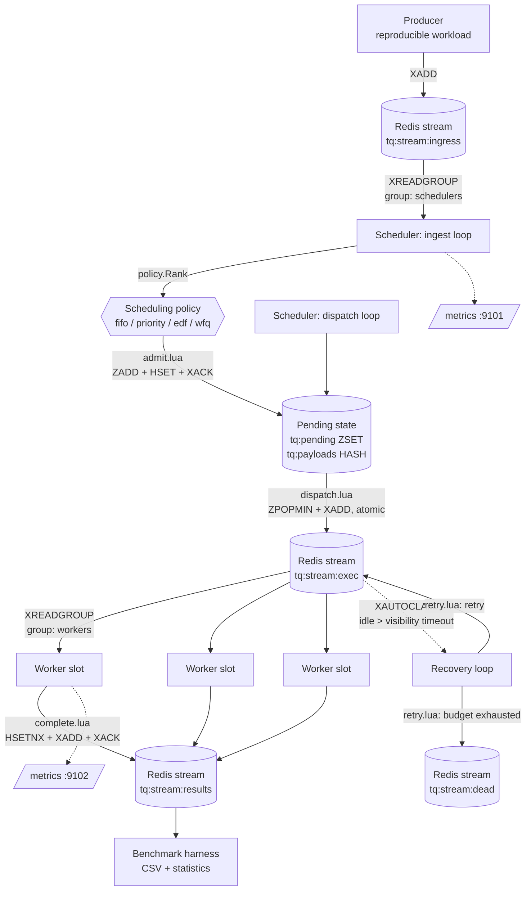

# Architecture

## Purpose

The system exists to answer one question empirically:

> How does the choice of scheduling policy affect latency, throughput, deadline
> compliance, fairness and starvation in a distributed task queue under
> different workload distributions?

Everything below is shaped by that goal. The scheduler is a real, central
decision point rather than an emergent property of how workers happen to
consume, because a queue where workers pull in arrival order can only ever
demonstrate FIFO.

## Components

| Component | Package | Role |
| --- | --- | --- |
| Producer | `cmd/producer`, `internal/workload` | Generates a reproducible finite workload and appends it to the ingress stream. Knows nothing about scheduling. |
| Scheduler | `cmd/scheduler`, `internal/scheduler` | Ingests, ranks with the configured policy, and atomically dispatches to workers. Single writer, enforced by a lease. Run several: one leads, the rest stand by. |
| Lease | `internal/lease` | Redis-backed leader election with a monotonic fencing token. The mechanism that makes "single writer" a property of the system rather than of the deployment manifest. |
| Policies | `internal/scheduler/{fifo,priority,edf,wfq}` | Pluggable ranking algorithms behind one interface. |
| Worker | `cmd/worker`, `internal/worker` | Consumes the execution stream, simulates work, records terminal results idempotently. |
| Recovery | `internal/recovery` | Reclaims deliveries that exceeded the visibility timeout; retries or dead-letters them. Runs inside the scheduler process. |
| Broker | `internal/broker` | Every Redis interaction, including the Lua scripts that make hand-offs atomic. |
| Metrics | `internal/metrics` | Prometheus instrumentation for the scheduler and workers. |
| Benchmark | `cmd/benchmark`, `internal/bench` | Runs the experiment matrix and writes CSV output. |
| Inspection | `cmd/tqctl` | Live queue state and dead-letter inspection. |

## Data flow



ASCII equivalent:

```text
  Producer
     |  XADD
     v
  ingress stream ---- XREADGROUP (group: schedulers) ----> Scheduler ingest
                                                              |
                                                       policy.Rank(task)
                                                              |  admit.lua (atomic)
                                                              v
                                                    pending ZSET + payload HASH
                                                              |
                                             dispatch.lua: ZPOPMIN + XADD (atomic)
                                                              v
  exec stream ---- XREADGROUP (group: workers) ----> Worker slots (simulate work)
        ^                                                     |
        |                                        complete.lua: HSETNX + XADD + XACK
        |  XAUTOCLAIM after visibility timeout                v
        +---------------- Recovery loop                results stream
                              |
                              +-- budget exhausted --> dead-letter stream
```

## Why the scheduler is a real decision point

Workers never see a task the scheduler has not chosen. Three properties enforce
that:

1. Producers write only to the ingress stream. Nothing consumes it except the
   scheduler.
2. The pending set is a Redis sorted set keyed by the policy's ordering score.
   Dispatch is `ZPOPMIN`, so the policy decides what leaves the queue.
3. `scheduler.max_in_flight` bounds how many tasks are dispatched but not yet
   terminal. Without this bound the execution stream would fill up and become
   the real queue, degrading every policy to arrival order. Setting it close to
   the total number of worker slots keeps the pending set deep and the decision
   meaningful.

## Leadership, and why a lock is not enough

The scheduler owns the pending index and the policy's virtual clock, both of
which live partly in memory. Two schedulers ranking the same stream do not
simply duplicate work. Each advances its own copy of the virtual clock against
roughly half the traffic, and then the two flush to the same hash, where the
later write wins. Nothing errors. No counter moves. The only symptom is that the
fairness numbers are wrong, and only if somebody is looking.

Before this was enforced, the invariant was a comment in a Kubernetes manifest
and `replicas: 1`. That is a real defence against the common case and no defence
at all against `kubectl scale`, against a second process started by hand from
the instructions in this repository's own README, or against a `Recreate`
rollout's unavoidable dispatch gap.

### The lease

`<ns>:leader` is taken with `SET NX PX`, renewed by its holder about three times
per TTL, and released on clean shutdown. Acquisition also stamps the grant with an
**epoch**: a counter INCRed once per grant, so every term is strictly newer than
every term before it. Acquisition and the INCR happen inside one Lua script, so
the gap between "nobody holds it" and "I hold it" does not exist.

### Why the epoch is the part that matters

A lease alone is not sufficient, and the reason is worth stating plainly because
it is the failure most implementations of this get wrong.

A leader can lose its lease without knowing. A garbage-collection pause, a
suspended container, or a partition that outlasts the TTL all produce the same
situation: Redis expires the key, a standby wins the next grant, and some time
later the old leader resumes, still believing it leads. No amount of careful
renewal closes that window, because the old leader is not executing during it,
and cancelling its context cannot help for exactly the same reason.

So the epoch travels with every write the leader makes, and the check lives at
the resource:

```lua
local function fenced(fenceKey, epoch)
  if epoch <= 0 then return false end          -- election disabled
  local cur = tonumber(redis.call('GET', fenceKey) or '0')
  if epoch < cur then return true end          -- superseded: refuse
  if epoch > cur then redis.call('SET', fenceKey, epoch) end
  return false
end
```

Redis remembers the highest epoch that has successfully written. Anything lower
is refused, permanently, from the instant the successor makes its first write.
There is no clock comparison and no assumption about how long a process was
stopped. Cancelling the deposed leader's context is a courtesy that makes the
common case fast; this is the guarantee.

Both guarded operations matter, for different reasons:

- **dispatch** — a stale leader that could still dispatch would hand workers
  tasks chosen by an out-of-date virtual clock, and that is real work, already
  executed by the time anyone noticed.
- **policy state flush** — the quiet one. The write always succeeds without a
  fence, and afterwards the only thing wrong is the fairness.

A non-positive epoch means election is disabled, and the guard then does nothing
at all. That is deliberate: a single-scheduler deployment, the benchmark harness
and every test written before the lease existed take exactly the path they
always did.

### The dispatch log records which term wrote each entry

Every execution-stream entry is stamped with the epoch that dispatched it. The
queue does not need that field to run. It is there so the fence's guarantee is
checkable from the data rather than only from the code: replay the stream in
order, and the epochs must never go backwards.

This is what makes the claim falsifiable. Removing the fence and running the
gray-failure test makes the violation appear in the log immediately — 172 of 400
entries dispatched under a dead term in the recorded run — and the same check
runs over every failover trial, where it has always been zero.

Retries carry no epoch, because a worker re-queues them rather than a leader
dispatching them. A reader treats a missing epoch as "not attributable to a
term" and skips it, rather than reading it as term zero and manufacturing an
inversion at every retry.

### What a failover costs

Measured, not asserted — see `cmd/failoverbench` and section 4.7 of the report:

| Event | Dispatch outage |
| --- | --- |
| Clean shutdown or rollout | About one dispatch interval. The lease is released, so nothing waits. |
| Hard crash | About one lease TTL. Redis must expire the key before a standby can safely take over. |
| Hard crash, one replica | Unbounded. Nothing takes over. |
| Leader frozen past its lease, then resumed | One lease TTL, and the resumed leader is refused at the resource. This is the case the fence exists for; see the `pause` arm. |

Lowering the TTL shortens failover and raises the chance that an ordinary
latency spike is mistaken for a death. The default of 5s with a 1.5s renewal
gives a healthy leader three attempts to ride out a slow round trip.

### What a promoted standby has to do

Taking over is not just "start dispatching":

1. **Reload policy state.** Done at the start of every term, not once at process
   start, so a standby promoted an hour after it booted adopts the clock as the
   previous leader left it.
2. **Reclaim stranded ingress entries.** `XREADGROUP` with `>` only delivers
   entries nobody has seen. An entry the dead leader read and never acknowledged
   belongs to a consumer name that will never return, so no successor is ever
   offered it again. The task was accepted from the producer's point of view and
   then never scheduled: not pending, not in flight, not dead-lettered, counted
   nowhere. The leader therefore runs `XAUTOCLAIM` over the ingress group and
   re-admits what it finds, which is safe because admission is idempotent.

   This was not a hypothetical. It showed up as exactly one stranded task in
   every killed-leader trial of `cmd/failoverbench`, which is how it was found.

   `scheduler.ingest_reclaim_min_idle` defaults to 2s, far below the exec
   stream's 15s visibility timeout, and the asymmetry is the point: a worker
   legitimately holds an exec entry for as long as the task runs, while a
   scheduler holds an ingress entry for the microseconds between reading it and
   admitting it. Anything pending for two seconds is not busy, it is dead.

### What is not leader-only

The recovery loop runs on every replica. Every path it can take is already
idempotent — `XAUTOCLAIM` hands a message to exactly one claimant, and the retry
script checks the `done` hash before acting — and making it leader-only would
mean a leader wedged mid-term stops the queue healing itself, which is the one
situation recovery exists for.

## The scheduling abstraction

```go
type Policy interface {
    Name() string
    Rank(t domain.Task) Key       // ordering key; may mutate policy state
    Notify(k Key)                 // a ranked task was actually dispatched
    State() map[string]string     // state that must survive a restart
    Restore(state map[string]string) error
}

type Key struct {
    Score  float64 // lower dispatches first
    Member string  // "<zero-padded submit millis>|<task id>", the tie-break
}
```

A policy never removes tasks itself. The surrounding machinery always dispatches
the smallest `Key` first, ordering by `Score` and then lexicographically by
`Member`.

This is the design's key simplification: **Redis sorted sets order equal-score
members lexicographically by byte value, which is exactly Go string comparison.**
So the in-memory `policy.Queue` used by unit tests and the Redis `ZPOPMIN` used
in production cannot disagree. The ordering asserted by `internal/scheduler/*/…_test.go`
is the ordering the deployed system produces, and
`TestRedisDispatchMatchesPolicyOrdering` checks that claim against a real Redis.

Selecting a policy is a configuration change only (`scheduler.policy`, or
`--policy`). Producers and workers contain no policy-specific code.

## Persistent state, and why each piece is persisted

All keys are prefixed by `streams.namespace`.

| Key | Type | Contents | Why it must survive a restart |
| --- | --- | --- | --- |
| `<ns>:pending` | ZSET | member → policy score | Holds every admitted, undispatched task. Losing it loses accepted work and would force re-ranking. |
| `<ns>:pending_age` | ZSET | member → submission unix millis | Lets the oldest pending wait be found in O(1) for the starvation gauge, which the score-ordered pending set cannot answer. |
| `<ns>:payloads` | HASH | task id → task JSON | The authoritative copy of a task, including its current retry count. Deleted when the task becomes terminal. |
| `<ns>:done` | HASH | task id → completion unix millis | The idempotency guard. Also stops a reclaimed delivery from retrying an already terminal task. |
| `<ns>:sched_state` | HASH | policy state | WFQ virtual time and per-tenant virtual finish tags. Without it a restart resets every tenant's virtual clock to zero and briefly grants service to whichever tenant was furthest ahead. |
| `<ns>:inflight` | STRING | counter | Dispatched-but-not-terminal count, used to enforce `max_in_flight` across restarts. |
| `<ns>:stats` | HASH | counters | Admitted, dispatched, completed, retried, dead-lettered, deadline misses, duplicate completions. |
| `<ns>:tenant_service`, `<ns>:tenant_count` | HASH | tenant → millis / count | Completed service per tenant: the `x` vector of Jain's fairness index. |
| `<ns>:leader` | STRING | `owner|epoch`, with a TTL | Holding it is leadership. It expires on its own, which is what lets a standby take over from a leader that died without releasing it. |
| `<ns>:leader_epoch` | STRING | counter | One INCR per grant. Never reset, not even by `Reset`, because a reused token could fence out a healthy leader. |
| `<ns>:fence` | STRING | highest epoch that has written | The enforcement point. A write carrying a lower epoch is refused permanently. |
| `<ns>:stream:{ingress,exec,results,dead}` | STREAM | messages | The four streams, with consumer groups on ingress and exec. |

Policy state is flushed every `scheduler.state_flush_interval` and once more on
graceful shutdown. Between flushes, a crash can lose at most one interval of
virtual-clock advance; the pending set itself is always durable because it is
written synchronously on admission.

## Atomicity

Four Lua scripts carry the correctness of the system. Each runs atomically
inside Redis.

**`admitScript`** — ingress → pending.
Rejects a task that is already pending, in flight or completed, then writes the
payload, adds to both pending sorted sets and bumps the admitted counter. This
is what makes a redelivered ingress entry harmless after a scheduler crash.

**`dispatchScript`** — selection → delivery.
`ZPOPMIN` and `XADD` happen in the same atomic unit. A task therefore cannot be
lost in the gap between "the scheduler chose it" and "a worker can see it":
either both the pop and the publish happened, or neither did. It also enforces
`max_in_flight` inside the script, so concurrent dispatch attempts cannot
overshoot the cap.

**`completeScript`** — terminal success.
`HSETNX` on the `done` hash is the single source of truth for idempotency. On a
first completion it deletes the payload, writes the result record, updates
counters and tenant service, and decrements the in-flight counter. On a
duplicate it increments a duplicate counter and writes nothing. In both cases it
`XACK`s the delivery **in the same script**, so an acknowledgement can never be
lost after a result was recorded.

**`retryScript`** — failure → retry or dead letter.
Refuses to act on an already terminal task, then either republishes the task
with an incremented retry count and a new attempt ID, or writes a dead-letter
record with failure metadata and marks the task terminal. The old delivery is
`XACK`ed inside the same script, so a crash can neither duplicate the retry nor
strand the entry in the pending entries list.

Deployment assumption: a single, non-clustered Redis 7+ instance. Every script
declares all the keys it touches and never derives key names from data, but the
design has not been validated against Redis Cluster key-slot constraints.

## Concurrency model

- **Scheduler**: one process, three goroutines — ingest, dispatch, observe. The
  policy is guarded by a mutex because ingest calls `Rank` and dispatch calls
  `Notify`. It is a single-writer component by design; the Kubernetes Deployment
  pins `replicas: 1` with a `Recreate` strategy.
- **Worker**: `worker.concurrency` goroutines, each its own consumer in the
  worker group, each reading one entry at a time. Reading one at a time is
  deliberate: buffering inside a worker would move queueing out of the scheduler.
- **Recovery**: one goroutine on a ticker inside the scheduler process.
- **Benchmark**: runs a scheduler, a recovery loop and N workers in-process per
  experiment against an isolated namespace.

No component busy-loops. The dispatch loop backs off by `scheduler.idle_sleep`
when there is nothing to dispatch, ingest blocks in `XREADGROUP`, workers block
in `XREADGROUP`, and recovery runs on a ticker.

## Graceful shutdown

On SIGINT or SIGTERM:

- The **scheduler** stops consuming ingress, lets the in-flight dispatch pass
  finish, flushes policy state, and shuts the metrics server down cleanly so the
  final scrape is not truncated. It also **releases the lease**, which is what
  makes a planned shutdown cheap: the standby takes over immediately instead of
  waiting out a TTL that nothing is actually uncertain about. This is the entire
  difference between a rollout and a crash.
  
  The one case where the lease is deliberately *not* released is when this
  process has been fenced out, because the write would be refused anyway and the
  lease already belongs to somebody else.
- **Workers** stop reading new entries immediately. Tasks already executing
  continue on a detached context bounded by `worker.shutdown_grace` so they can
  finish and acknowledge. Anything unfinished when the grace period expires is
  left unacknowledged, which is safe: the recovery loop redelivers it after the
  visibility timeout. Kubernetes `terminationGracePeriodSeconds` is set above
  `shutdown_grace` so the pod is not killed mid-task.

## Simulated execution

Workers sleep for the task's declared duration instead of doing application
work. This makes task sizes exactly controllable, which is what allows a
heavy-tailed distribution to be specified rather than hoped for, and removes
application variance from the comparison between policies. The cost is that
utilisation numbers reflect wall-clock occupancy of a slot, not CPU work, and
that WFQ knows each task's true cost in advance — see the caveats in
[experiments.md](experiments.md).

## Health and readiness

Both the scheduler and the workers serve `/healthz` and `/readyz` from their
metrics endpoint, and the split matters:

- `/healthz` answers as soon as the process starts, **before** the broker is
  dialled. It means "this process is alive".
- `/readyz` returns 503 until the component has actually started consuming, and
  200 afterwards. It means "this process can do work".

A scheduler standing by is **ready**. It is connected, campaigning, and one
lease expiry away from serving, and reporting otherwise would be wrong in two
concrete ways: Kubernetes would drop it from the Service and stop Prometheus
scraping the very metric that says who leads, and a Deployment whose spare
replica never becomes ready cannot complete a rolling update. "Am I leading?" is
a question for `tq_scheduler_is_leader`, not for a readiness probe.

Starting the HTTP server after connecting to Redis would be a mistake, and was
one during development: a Redis that takes a few seconds to become available
during a rollout made the liveness probe fail, Kubernetes killed the container
mid-wait, and an ordinary startup looked like a crash loop with a rising restart
count. A slow dependency must fail readiness, never liveness.

For the same reason the processes wait for Redis rather than exiting when it is
absent: `--redis-wait` (60s by default) retries with a capped backoff and logs
once when it starts waiting and once when the broker appears. Setting it to `0`
restores fail-fast behaviour. `tqctl` deliberately keeps failing immediately,
because it is an interactive command rather than a supervised service.
