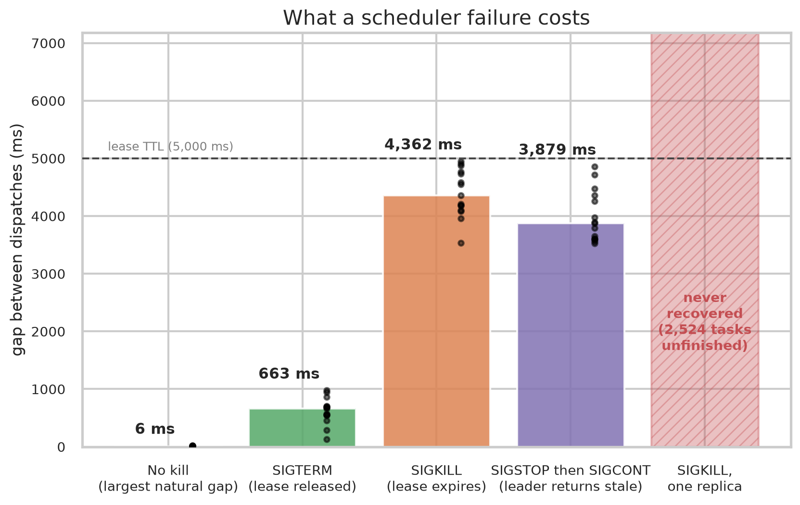
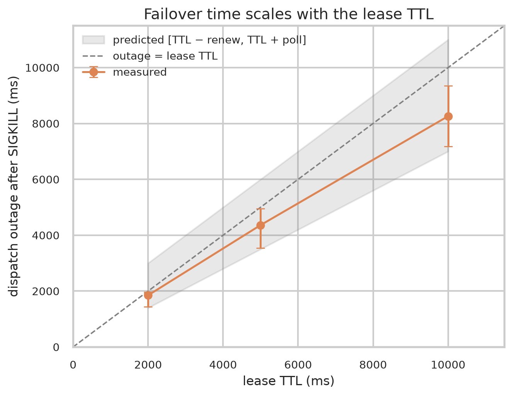
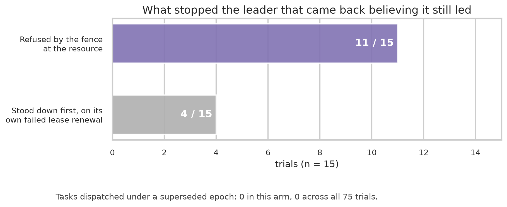

# An Empirical Comparison of Scheduling Policies in a Distributed Task Queue

*Latency, deadline compliance, fairness and starvation under controlled load*

Anish Choudhury — September 2026 · [source](https://github.com/anishc23/distributed-task-queue-scheduler) · [PDF](report.pdf)

## Abstract

Most distributed task queues hard-code a single queue discipline, almost always
arrival order. This report treats the discipline as an experimental variable. A
task queue was built in Go on Redis Streams in which the scheduling policy is a
pluggable component chosen by configuration, and four policies — FIFO, strict
priority, earliest deadline first (EDF) and weighted fair queuing (WFQ) — were
compared across four synthetic workloads, seven levels of offered load, and two
models of task execution.

The study comprises **1,363 experiments over 4.88 million tasks**. Four results
are reported. First, scheduling policy is decisive only in a narrow band around
service capacity: the spread between the best and worst policy's 99th-percentile
latency is 0.1% at half capacity, peaks at 93% at capacity, and falls to 1.1% at
three times capacity. Second, centralising the scheduling decision costs
approximately 1.5% of throughput, while *using* that decision costs 6–10% and
returns improvements of one to two orders of magnitude in the metric each policy
targets. Third, and least expected, the common practice of simulating task
execution with sleeps is not a neutral simplification: it systematically
flatters deadline-aware scheduling, because EDF's advantage depends on declared
task durations that real execution invalidates. WFQ is unaffected by the same
error, and the asymmetry has a clean explanation. Fourth, the availability cost
of that central scheduler is bounded and measurable: enforcing its single-writer
invariant with a fenced Redis lease costs under 1% of scheduling throughput, a
crash costs a median 4.4 s of dispatch outage against a 5 s lease, and with no
standby the queue never recovers at all. That last result is tested against the
failure it is actually designed for — a leader frozen past its lease and then
resumed, rather than killed — where the fence, and not the lease, is what
refused the returning leader in 11 of 15 trials.

Three quantitative claims made earlier in this work were subsequently found to
be wrong and are corrected here. That process is reported rather than concealed,
because the corrections are among the more instructive outcomes.

## 1. Introduction

### 1.1 Research question

> How does the choice of scheduling policy affect latency, throughput, deadline
> compliance, fairness and starvation in a distributed task queue under
> different workload distributions and levels of offered load?

The contribution is empirical rather than algorithmic. All four policies are
well established. What is measured is their behaviour under controlled
conditions in one concrete system, together with the conditions under which the
differences between them matter at all.

### 1.2 Scope and honest framing

The system is a task queue built on a single Redis instance with a
single-writer scheduler. Most of the genuinely hard distributed-systems problems
— consensus, partitioning, network partitions, clock skew — are absent or
delegated to Redis. It is more accurately described as a scheduling study on a
Redis-backed queue than as a distributed system, and is described that way
throughout.

One of them is not delegated. The single-writer scheduler is a coordination
problem in its own right, and Section 4.7 treats it as one: leadership is a
Redis lease with a monotonic fencing token, failure detection is lease expiry,
and the resulting failover behaviour is measured rather than asserted. The
fencing argument is the standard one — a lock alone cannot stop a process that
was paused past its lease, so the check has to live at the resource — and
implementing the fence rather than only the lock is what makes "exactly one
scheduler dispatches" a property of the system rather than of its deployment
manifest. That is a narrow slice of the distributed-systems problem space, and
it is claimed as nothing more.

## 2. System design

### 2.1 Data flow

```
Producer ──XADD──▶ ingress stream
                        │ XREADGROUP (scheduler group)
                        ▼
                  rank with policy ──▶ pending ZSET + payload HASH
                        │
                        │ atomic ZPOPMIN + XADD
                        ▼
                  exec stream ──XREADGROUP──▶ worker slots
                        ▲                          │
                        │ XAUTOCLAIM               │ atomic HSETNX + XADD + XACK
                        │ after visibility timeout ▼
                   recovery loop            results stream
                        │
                        └── budget exhausted ──▶ dead-letter stream
```

Producers write only to the ingress stream; workers see only what the scheduler
has already ranked and dispatched. `max_in_flight` bounds dispatched-but-
unfinished work so the backlog remains in the scheduler's pending set, where the
policy controls it, rather than in the execution stream, where it would not.

### 2.2 The scheduling abstraction

A policy converts a task into an ordering key and nothing else:

```go
type Key struct {
    Score  float64 // lower dispatches first
    Member string  // "<zero-padded submit millis>|<task id>"
}
```

The surrounding machinery always dispatches the smallest key. This exploits a
property of Redis: sorted sets order equal-score members lexicographically by
byte value, which is exactly Go string comparison. The consequence is that the
in-memory priority queue used by unit tests and the `ZPOPMIN` used in production
**cannot disagree**, so the ordering asserted in tests is the ordering the
deployed system produces. An integration test verifies the equivalence against a
live Redis.

### 2.3 Policies

**FIFO** orders by submission time. The experimental baseline.

**Strict priority** packs priority and submission time into one float64 as
`(255 − priority)·10¹³ + submitted_millis`. Unix milliseconds stay below 10¹³
until the year 2286, so a timestamp cannot leak into an adjacent priority band,
and the largest score remains inside the range where float64 represents integers
exactly. No ageing: starvation is measured, not mitigated.

**EDF** orders by absolute deadline, with tasks lacking deadlines sorted last.

**WFQ** implements self-clocked fair queuing over tenants. On admission of task
*t* from tenant *k* with weight *w_k*:

```
start  = max(virtualTime, lastFinish[k])
finish = start + cost(t) / w_k
```

and on dispatch, `virtualTime = max(virtualTime, finish)`. Because a newly
active tenant starts at `max(virtualTime, lastFinish)`, an idle tenant cannot
bank credit and flood the queue. Documented approximations: virtual time
advances on dispatch events rather than by emulating a fluid server; scheduling
is non-preemptive at whole-task granularity; and `cost(t)` uses the task's
declared duration, an oracle assumption that Section 5.3 shows is consequential.

### 2.4 Correctness

Four Lua scripts carry the system's correctness, each atomic inside Redis.
Dispatch performs `ZPOPMIN` and `XADD` in one unit, so a task cannot be lost
between selection and delivery. Completion is guarded by `HSETNX` on a hash of
completed task IDs, in the same script that writes the result record and
acknowledges the delivery.

The guarantee is stated precisely: **at-least-once delivery with completion
recorded exactly once per task ID.** A task body may execute more than once;
exactly-once delivery is not claimed. This was verified under a genuine race by
setting the visibility timeout below the task duration, so the recovery loop
reclaims work that is still legitimately running and two workers race to
complete the same task. Duplicate completions were suppressed and every task
appeared exactly once in the results stream.

A second invariant is enforced in the same place: **exactly one scheduler ranks
and dispatches at a time.** This one is not about losing work, it is about
losing meaning. The policy's virtual clock lives in the scheduler's memory, so
two schedulers each advance their own copy against part of the traffic and then
overwrite each other's persisted state. Nothing errors and no counter moves;
only the fairness numbers are wrong.

Leadership is a Redis lease (`SET NX PX`, renewed, released on clean shutdown),
and each grant carries an **epoch** from a monotonic counter. The epoch, not the
lease, is what makes this sound. A leader paused past its TTL by a
garbage-collection pause or a suspended container resumes believing it leads,
and no amount of careful renewal closes that window because the leader is not
executing during it. So the epoch travels with every write the leader makes, and
the check runs inside the same atomic script as the write:

```lua
if epoch < fence then return redis.error_reply('TQFENCED ...') end
if epoch > fence then redis.call('SET', fenceKey, epoch) end
```

Admission and dispatch are both guarded. Guarding admission matters for a reason
that is easy to miss: the score written at admission is not a property of the
task, it is produced by the policy's virtual clock, so a superseded leader that
could still admit would insert tasks at positions derived from a clock it no
longer owns. A non-positive epoch means election is disabled and the guard is
inert, which is the path the benchmark harness takes.

## 3. Methodology

### 3.1 Experimental design

Four schedulers × four workloads, repeated with controlled seeds. Each
experiment runs in its own Redis key namespace, and every CSV row repeats the
full run identity, so results from different runs cannot be pooled by accident.

Workloads are finite and seeded. For a given seed and configuration the
generated task sequence is byte-identical on any machine: every random value
comes from one seeded source consumed in a fixed order per task. Timing is not
reproducible, only the workload; repetitions and reported variance are the
mitigation.

### 3.2 Offered load

Comparing policies across workloads is only meaningful at equal load relative to
what the system can serve:

```
capacity     = worker_slots / mean_execution_seconds
offered_load = mean_arrival_rate / capacity
```

Computing this per workload proved necessary rather than pedantic. The
heavy-tailed workload has a mean service time of 51.4 ms against 50.1 ms for the
others, so an identical arrival rate is a different load. More seriously, the
bursty workload ignores its nominal arrival-rate parameter entirely — its
arrivals derive from the burst schedule — and its duration-weighted mean rate
was 500/s against 400/s for the other three. **Every bursty measurement in an
earlier revision of this work was therefore taken at 1.57× capacity while the
others sat at 1.25×**, which is a confound, not a rounding difference, and
explains why bursty showed a 0.94 deadline miss rate: it was simply run harder.

The load sweep is valid only if changing the arrival rate changes nothing else.
It does not: the generator draws arrival gap, tenant, duration, priority and
deadline jitter in a fixed order per task, so altering the rate alters gap
values without moving the stream position. A test asserts byte-identical
durations, priorities, tenants and deadlines across a ninefold rate change for
all four workload types.

### 3.3 Repetition counts

How many repetitions a workload needs is not uniform. All four were re-run at 25
repetitions to find out, giving a 5-versus-25 comparison over 96
workload/scheduler/metric combinations.

| workload | 5-rep CIs missing the truth | median shift | verdict |
| --- | ---: | ---: | --- |
| uniform | 8 / 24 | 0.60% | converged |
| bursty | 1 / 24 | 0.13% | converged |
| multi_tenant | 0 / 24 | 0.26% | converged |
| heavy_tailed | 1 / 24 | **8.42%** | **not converged** |

**Interval coverage is the wrong convergence diagnostic, and `uniform` proves
it.** `uniform` is the most stable workload in the matrix and has by far the
*most* confidence intervals that missed — eight, against one for the genuinely
unconverged heavy-tailed workload. The mechanism is mechanical: a stable metric
produces a narrow interval that a 1% shift escapes, while a noisy metric
produces a wide interval that almost nothing escapes. Coverage measures how
stable a metric is, not how converged the estimate is. The **median shift in the
point estimate** separates the workloads cleanly where coverage does not.

The distinguishing property is the task-duration distribution, not the arrival
pattern: bursty arrivals and skewed tenants both average out over 4,000 tasks; a
Pareto tail does not.

### 3.4 Environment

macOS 26.6 on an Apple M5 (10 cores), Redis 8.10.1 on localhost, Go 1.27. The
main matrix uses 4 worker processes × 4 slots = 16 slots against a capacity of
approximately 319 tasks/s. Real-work experiments use 8 slots on 10 cores, for
reasons given in Section 5.3.

The failover experiments of Section 4.7 have a stricter requirement, because
they measure wall-clock gaps rather than aggregate rates: anything else running
on the machine lands directly in the number. Two runs were discarded for that
reason and are not reported. The first was invalidated by starting a
race-detector test suite alongside it. The second was invalidated by the laptop
idle-sleeping partway through an unattended run, which produced two trials
reporting seventeen-minute outages against a five-second lease.

The second failure is now caught rather than averaged in. A crash outage is
bounded above by the lease TTL by construction, so the harness flags any trial
exceeding five times the TTL as suspect and the analysis drops it while
printing what it dropped. Reporting a number that cannot come from the
mechanism under test is a failure of the harness, not of the run.

## 4. Results

### 4.1 Main matrix

Twenty-five repetitions per cell at 1.25× offered load, 400 experiments,
1.6 million tasks. Latency and wait columns are seconds.

| workload | sched | p50 | p99 | maxwait | miss | tasks/s | Jain |
| :--- | :--- | ---: | ---: | ---: | ---: | ---: | ---: |
| uniform | fifo | 1.486 | 2.917 | 2.900 | 0.791 | 308.8 | 0.999 |
| uniform | prio | 0.109 | 4.491 | 4.492 | 0.462 | 308.3 | 0.999 |
| uniform | edf | 1.483 | 2.992 | 3.069 | 0.788 | 308.3 | 0.999 |
| uniform | wfq | 1.476 | 3.240 | 3.270 | 0.786 | 308.2 | 0.999 |
| bursty | fifo | 3.216 | 6.245 | 6.273 | 0.943 | 308.9 | 0.999 |
| bursty | prio | 1.705 | 7.538 | 7.561 | 0.704 | 308.1 | 0.999 |
| bursty | edf | 3.158 | 6.306 | 6.389 | 0.937 | 308.1 | 0.999 |
| bursty | wfq | 3.184 | 6.345 | 6.389 | 0.943 | 308.2 | 0.999 |
| heavy-tail | fifo | 0.749 | 1.686 | 1.613 | 0.482 | 282.7 | 0.979 |
| heavy-tail | prio | 0.096 | 2.685 | 2.681 | 0.343 | 281.7 | 0.979 |
| heavy-tail | edf | 0.031 | 1.271 | 6.163 | **0.001** | 257.6 | 0.979 |
| heavy-tail | wfq | 0.394 | 2.487 | 2.574 | 0.354 | 270.5 | 0.979 |
| multi-ten | fifo | 1.479 | 2.920 | 2.907 | 0.780 | 308.4 | 0.246 |
| multi-ten | prio | 0.105 | 4.462 | 4.467 | 0.457 | 308.4 | 0.246 |
| multi-ten | edf | 1.459 | 2.976 | 3.044 | 0.775 | 308.3 | 0.246 |
| multi-ten | wfq | 1.490 | 2.932 | 2.910 | 0.727 | 308.4 | 0.246 |

Throughput is flat within 0.3% across policies on three of four workloads, as it
should be: work-conserving schedulers change who waits, not how much work gets
done. The exception is heavy-tailed, where EDF delivers 257.6 tasks/s against
FIFO's 282.7 and utilisation falls to 0.73 from 0.80 — deferring long tasks
leaves slots idle at the end of a run while the deferred work drains.

### 4.2 Starvation under strict priority

p95 latency by priority level, uniform workload, 25 repetitions pooled over
100,000 tasks per scheduler:

| sched | prio 0 | prio 1 | prio 2 | prio 3 | prio 4 | spread |
| --- | ---: | ---: | ---: | ---: | ---: | ---: |
| fifo | 2.796 | 2.797 | 2.797 | 2.797 | 2.819 | 1.0× |
| **priority** | **4.416** | 0.079 | 0.075 | 0.074 | 0.073 | **60.4×** |
| edf | 2.816 | 2.813 | 2.809 | 2.811 | 2.834 | 1.0× |
| wfq | 2.954 | 2.953 | 2.947 | 2.941 | 2.967 | 1.0× |

Everything above priority 0 completes in about 75 ms while priority 0 waits
4.4 s. FIFO, EDF and WFQ show a flat 1.0×, because none of them reads the
priority field.

### 4.3 Fairness under tenant skew

Jain's fairness index is defined over completed service seconds per tenant:

```
J(x) = (Σxᵢ)² / (n · Σxᵢ²)
```

with zero-service tenants included as zeros — omitting them would report perfect
fairness for a queue that served exactly one tenant.

**The index cannot distinguish the policies on this workload, and it is
important to say why.** Under the 90/3/3/2/2 skew every policy reports 0.246,
near the 1/n = 0.2 floor, because the index is *demand-limited*: tenants B–E
submit a few percent of the work, so no scheduler can grant them a large share
of service. That is a property of the workload, not a failure of the scheduler.

Per-tenant latency is the metric that does distinguish them:

| sched | A (90%) | small (mean) | ratio |
| --- | ---: | ---: | ---: |
| fifo | 2.798 | 2.762 | 0.987× |
| priority | 4.253 | 4.191 | 0.986× |
| edf | 2.791 | 2.754 | 0.987× |
| **wfq** | 2.858 | **0.078** | **0.027×** |

WFQ gives the small tenants 35× lower p95 latency at a 2% cost to the dominant
tenant. Under the other three policies the small tenants are queued behind the
noisy neighbour's backlog and see essentially its latency — equal treatment that
is not isolation. Reporting the fairness index alone would have shown four
identical bars and missed the effect entirely.

### 4.4 Policy choice depends on load

Seven load levels from 0.5× to 3× capacity, 336 experiments, 1.34 million tasks.
Spread between best and worst policy p99 on the uniform workload:

| offered load | 0.50× | 0.75× | 1.00× | 1.25× | 1.50× | 2.00× | 3.00× |
| --- | ---: | ---: | ---: | ---: | ---: | ---: | ---: |
| p99 spread | 0.1% | 0.3% | **93.1%** | 55.5% | 28.4% | 2.1% | 1.1% |

**Scheduling policy is decisive only in a narrow band around capacity.** Below
capacity there is no queue, so every policy dispatches immediately. Far above
it, the backlog dominates: the makespan is fixed by total work and p99
approaches it whatever order is chosen. This is invisible from any single
operating point and is the most generally useful result in the study.

It also carries a practical warning: an evaluation of scheduling policies
conducted at an arbitrary load may find no difference and conclude, wrongly,
that policy does not matter.

### 4.5 EDF under overload

An earlier revision of this work asserted in three places that EDF "degrades
sharply under overload", following classical theory, which warns that EDF keeps
preferring already-doomed tasks and misses them anyway while delaying tasks that
were still achievable. **The data does not support that here.** Deadline miss
rate on the heavy-tailed workload:

| offered load | 0.50× | 1.00× | 1.25× | 1.50× | 2.00× | 3.00× |
| --- | ---: | ---: | ---: | ---: | ---: | ---: |
| fifo | 0.000 | 0.123 | 0.645 | 0.799 | 0.860 | 0.893 |
| priority | 0.000 | 0.154 | 0.415 | 0.453 | 0.508 | 0.683 |
| **edf** | 0.000 | **0.000** | **0.005** | **0.368** | **0.635** | **0.769** |
| wfq | 0.000 | 0.088 | 0.507 | 0.690 | 0.798 | 0.864 |

EDF has the lowest miss rate at every load tested; its advantage narrows from
roughly 129× better than FIFO at 1.25× to 1.16× at 3×, but never inverts. The
classical pathology requires deadlines that are tight relative to service time,
whereas these are generous and scale with each task's own duration, so a
deferred long task usually still meets its deadline. The result is therefore a
property of the workload as much as of the policy.

What EDF does pay, at every load, is starvation: its longest queue wait is three
to four times FIFO's and saturates near 9.6 s, because it defers precisely the
large tasks whose deadlines are furthest away. Miss rate and maximum wait must
be read as a pair.

### 4.6 The cost of centralisation

The scheduler is a deliberate single-writer component. Three measurements
establish what it costs: its own capacity, the price of enforcing the
single-writer invariant, and its overhead against having no scheduler at all.
Section 4.7 adds the fourth cost, which is availability.

**Its own capacity.** With workers removed and the critical path driven
directly:

| stage | rate | note |
| --- | ---: | --- |
| dispatch, best case | 261,727 tasks/s | batch 256; atomic `ZPOPMIN`+`XADD` |
| admission | 15,204 tasks/s | one Redis round trip per task |
| **end to end** | **11,381 tasks/s** | both loops — the real ceiling |

Dispatch is 17× faster than admission, so dispatch was never the constraint: it
amortises a batch over one round trip while admission pays one per task. The
scheduler can feed approximately **569 worker slots** at a 50 ms mean task. It
follows that every experiment in this study ran the scheduler at about **3% of
its capacity**, so the policy comparisons measure policy rather than scheduler
saturation — a validity check the work could not previously make.

These figures were re-measured after the leader lease was added and reproduce
the earlier measurement of the same machine to within 1.6%.

**What enforcing the invariant costs.** The same measurement was run twice, once
with the fencing guard inert (`--epoch 0`, election off) and once with it live:

| stage | guard inert | guard live | change |
| --- | ---: | ---: | ---: |
| admission | 15,204/s | 15,009/s | −1.3% |
| **end to end** | **11,381/s** | **11,325/s** | **−0.5%** |
| dispatch, best case | 261,727/s | 264,043/s | +0.9% |

The correct reading is "below this measurement's noise floor", not "−0.5%": each
cell is a single run, dispatch came out faster fenced than unfenced, and WFQ's
admission moved the wrong way too. The structural reason the cost is small is
that the fence adds one `GET` *inside* a script that has already paid for its
round trip, plus a `SET` only on the first write of a new term. Enforcement
rides along on work that was happening anyway, which is an argument for putting
the check at the resource rather than in the client quite apart from its
correctness advantages.

**Its overhead, against no scheduler at all.** A control arm was added in which
workers consume the ingress stream directly, producing the same execution order
as FIFO. 240 experiments, 960,000 tasks.

| offered load | uniform | bursty | heavy_tailed | multi_tenant |
| --- | ---: | ---: | ---: | ---: |
| 0.75× | 0.0% | 0.2% | 0.0% | 0.0% |
| 1.25× | 1.5% | 1.6% | 1.2% | 1.6% |

Centralisation is unmeasurable below capacity and costs about **1.5%** above it:
the extra round trip through the pending set. What that enables costs
considerably more and returns considerably more (heavy-tailed, 1.25×):

| arm | miss | maxwait | tasks/s | vs. none |
| --- | ---: | ---: | ---: | ---: |
| none | 0.609 | 2.09 | 272.7 | — |
| fifo | 0.644 | 2.29 | 269.4 | −1.2% |
| priority | 0.415 | 3.69 | 262.3 | −3.8% |
| wfq | 0.508 | 3.38 | 255.2 | −6.4% |
| **edf** | **0.005** | 8.25 | 244.0 | −10.5% |

EDF trades 10.5% throughput for a 122× reduction in deadline misses; WFQ trades
6.4% for tenant isolation. **FIFO is the one arm that fails to justify itself**:
it costs 1.2% and delivers identical ordering, so it is strictly worse than
having no scheduler. FIFO earns its place here as an experimental baseline, not
as a deployment choice.

### 4.7 What a scheduler failure costs

Section 4.6 measured the *throughput* cost of centralising scheduling. That is
half the argument; the other half is availability, and an availability claim
that rests on reading the code is not a measurement.

**Method.** `cmd/failoverbench` builds the scheduler binary, starts real
processes with `os/exec` in their own process groups, and kills one with a real
signal — nothing about the failure is simulated. Workers and the load generator
run in the measuring process against the same Redis. The outage is defined
narrowly: the gap between the last task dispatched at or before the kill and the
first one after it, read from the `dispatched_at_ms` field the dispatch script
stamps on every execution-stream entry. Trials in which no dispatch ever follows
are **censored** rather than recorded as a large number.

The kill is jittered uniformly over one renewal interval, from a seeded
generator. Without that, every trial kills at the same phase of the renewal
cycle and the measured outage collapses to a single value — real, but not the
distribution. The first version of this experiment used a fixed offset and
produced fifteen outages within 4 ms of each other, which is what exposed the
bias.

Every trial also scrapes `tq_scheduler_is_leader` from all replicas before the
kill and refuses to proceed unless the sum is exactly 1, so each reported trial
carries evidence that the single-writer invariant held while it ran. Across the
75 trials below it was 1 every time.

A second check reads the invariant back out of the data. Every execution-stream
entry is stamped with the epoch that dispatched it, so replaying the stream in
order must produce epochs that never decrease; anything else is a superseded
leader that wrote after its successor. The harness counts these inversions in
every arm and aborts on the first one, and the plotting script refuses to chart
a run that contains any. **Across all 75 trials the count was zero.**

| arm | replicas | signal | what it answers |
| --- | ---: | --- | --- |
| `none` | 2 | — | the natural gap between dispatches, the floor everything else is read against |
| `graceful` | 2 | `SIGTERM` | what a rollout costs; the lease is released |
| `crash` | 2 | `SIGKILL` | what a crash costs; nothing is released |
| `single` | 1 | `SIGKILL` | what the lease is actually buying |
| `pause` | 2 | `SIGSTOP`, then `SIGCONT` | what the *fence* is buying; see Section 4.8 |

**Results** (15 trials per arm, 4,000 tasks each, 5 s lease, 1.5 s renewal, 1 s
standby poll):

| arm | n | median outage | range | tasks unfinished |
| --- | ---: | ---: | --- | ---: |
| `none` | 15 | 6 ms *(largest natural gap)* | 5–19 ms | 0 |
| `graceful` | 15 | **663 ms** | 132–976 ms | 0 |
| `crash` | 15 | **4,362 ms** | 3,536–4,951 ms | 0 |
| `pause` | 15 | **3,879 ms** | 3,524–4,860 ms | 0 |
| `single` | 15 | *never recovered* | — | **37,866** |

Three things are worth drawing out.

**The outage is not "one lease TTL", and the difference matters.** The obvious
model — a crash costs a TTL — is wrong in both directions. The correct one has
two terms:

```
outage = time until the lease is free + time until a standby next polls
```

A crash makes the first term `TTL − age of the last renewal`, uniform over
`[TTL − renew, TTL]`. A graceful stop makes it zero, because the leader releases
on the way out. Both then wait up to one `retry_interval` for a standby to
notice. The predicted windows are therefore `[3.5 s, 6.0 s]` for a crash and
`[0, 1.0 s]` for a rollout, and **all 15 trials in each arm fall inside them**.

The `pause` arm sits in the same window as `crash` — 15/15 inside `[3.5 s,
6.0 s]`, with a median of 3,879 ms against 4,362 ms — and it should, because
up to the moment of takeover the two are the same experiment: a leader stops
renewing and Redis expires its grant, whether the process is dead or merely
frozen. The 483 ms difference between the medians is not interpreted here. The
two ranges overlap almost completely and n is 15; nothing in the mechanism
predicts a difference, and reading one into this sample would be exactly the
kind of claim Section 4.6 declined to make about a 0.5% throughput gap.

The practical consequence is that a rollout's cost is a *polling artefact*, not
a property of the lease: 663 ms is simply half a poll interval. Publishing a
notification on release would remove it almost entirely, which is why it appears
in future work rather than as a tuning recommendation.

**The floor is 6 ms, so the signal is unambiguous.** The natural largest gap
between dispatches under this load is a median of 6 ms and never exceeded 19 ms.
A crash outage is roughly **730× that floor**, so none of these numbers depends
on separating a failover from ordinary scheduling jitter.

**The control arm is the argument for the lease.** With one replica, no trial
recovered at all. The queue stopped dispatching permanently and a median of
2,613 of 4,000 tasks per trial — 37,866 in total — never reached a terminal
state. Averaging those trials as a large finite number would misrepresent them
entirely, so they are censored, and the chart draws them as a hatched bar
spanning the axis rather than as a value.

**Nothing was executed twice.** Across all 75 trials the duplicate-completion
counter stayed at zero, and every trial in the four recovering arms finished all
4,000 tasks. That last property was not free; see Section 5.1.

**Failover time tracks the lease, which makes it a tuning decision.** The crash
arm was repeated at three lease TTLs, with the renewal interval held at
`TTL / 3.3` and the standby poll at 1 s throughout:

| lease TTL | n | median outage | range | predicted `[TTL − renew, TTL + retry]` | inside |
| ---: | ---: | ---: | --- | --- | ---: |
| 2 s | 12 | 1,850 ms | 1,437–1,960 | [1.4 s, 3.0 s] | 12/12 |
| 5 s | 15 | 4,362 ms | 3,536–4,951 | [3.5 s, 6.0 s] | 15/15 |
| 10 s | 12 | 8,259 ms | 7,172–9,343 | [7.0 s, 11.0 s] | 12/12 |

**All 39 trials fall inside the envelope the two-term model predicts.** The
medians sit a little below its midpoint at every TTL, and consistently so —
0.92×, 0.87× and 0.83× the TTL respectively — which says the standby tends to
find the lease sooner than a uniform poll offset would suggest. No mechanism is
claimed for that; it is a small systematic offset in the right direction, and
the envelope is the part the model is being tested on.

The operational reading is a trade, not an optimum. A shorter lease shortens
every crash outage and gives a healthy leader fewer renewal attempts to survive
a slow Redis round trip before being deposed for no reason. The 5 s default with
a 1.5 s renewal allows three such attempts, which is the reason it is the
default rather than the 2 s that looks better in this table.






### 4.8 The failure the fence is for

Everything in Section 4.7 kills the leader, and that is a weakness in the
argument rather than a strength. A lease on its own would have handled every one
of those arms: a dead process writes nothing, so the fencing token is never
loaded. Demonstrating a safety mechanism against a failure it is not needed for
proves only that it does no harm.

The case fencing tokens exist for is the one where the deposed leader is **still
running**. It was stopped long enough for its lease to expire — a
garbage-collection pause, a suspended container, a host that swapped, a
partition that outlasted the TTL — a standby took over, and then it resumed,
still holding its old epoch. Cancelling its context cannot stop it, because it
was not running to observe the cancellation. Nor can it be made to check whether
it still leads: any such check is separated from the write that follows it by a
window in which the answer can change, which is Kleppmann's objection to using a
lock alone. The check has to be at the resource, in the same atomic unit as the
write.

**Method.** A fifth arm, `pause`, produces that state with real signals rather
than a simulation of one. The leader is stopped with `SIGSTOP` for twice its
lease TTL — 10.2 s measured, against a 5 s lease — and then continued with
`SIGCONT`, after which it is given three further seconds to act before the trial
is allowed to end. Three conditions are verified rather than assumed, because a
fault-injection experiment that does not confirm the fault occurred can pass
while testing nothing:

1. the victim really is stopped, read from the operating system's process state
   rather than inferred from a signal call that returned no error;
2. a *different* process holds the lease before the victim is resumed, so it is
   genuinely superseded rather than merely slow;
3. after the resume, exactly one process still claims leadership.

**Result: the invariant held, and the fence is what held it.** Across 15 trials
no task was dispatched under a superseded epoch, no completion was duplicated,
all 4,000 tasks finished in every trial, and the leadership sum after each
resume was exactly 1.

What the resumed leader ran into differs between trials, and the split is the
interesting part:

| what stopped the superseded leader | trials |
| --- | ---: |
| **refused by the fence**, at the resource | **11 / 15** |
| stood down first, on its own failed lease renewal | 4 / 15 |

Both outcomes are correct, and the second is the same protection arriving one
layer earlier. But the first group is the one that matters for the design
question: **in 11 of 15 trials the resumed leader reached Redis with a write
before its own lease machinery had noticed anything was wrong.** A deployment
with leases but no fencing would have admitted a second writer in those eleven
cases. The logs show how narrow the margin is — resume, lease loss and fence
refusal all land within the same millisecond:

```
22:53:55.978  resumed the superseded leader   owner=sched-1 successor=sched-0
22:53:55.978  lost the scheduler lease        owner=sched-1 epoch=1
22:53:55.978  fenced out by a newer epoch, standing down   operation=dispatch
```

That is not a margin any implementation should be asked to win by being quick.

**The claim is falsifiable, and was falsified on purpose.** The corresponding
integration test drives an engine into the same state deterministically, by
giving it a lease whose renewal interval cannot fire inside the test window, so
the fence is the only thing that can stop it. With the fence removed from the
Lua guard, that test fails immediately: **172 of 400 tasks were dispatched under
a dead term**, concurrently with the legitimate leader, and the dispatch log
records every one of them. A test that has never been observed to fail is not
evidence about the mechanism it guards.

**What this does not cover.** A stopped process resumes with its connection to
Redis intact. A network partition is the other half of this failure mode and is
not reproduced here: it would break the path to the store as well as the
process's view of time, which is a different experiment and is named in
Section 6.1 rather than approximated.




## 5. Threats to validity

### 5.1 Corrections made during this study

Three quantitative claims were found to be wrong after more data was collected,
and two defects were found by the failover experiment rather than by review.

**The bursty load confound** (Section 3.2): bursty experiments ran at 1.57×
capacity while others sat at 1.25×, because the workload ignores its nominal
arrival-rate parameter. Corrected by deriving arrival rate per workload from
measured capacity.

**EDF's overload behaviour** (Section 4.5): asserted from theory in three places
before measurement, and contradicted by the sweep.

**EDF's real-work degradation** (Section 5.3): first reported as 27× from three
repetitions on the one workload already shown to require twenty-five. At n=25
the correct figure is 8.4×. The direction held; the magnitude was inflated more
than threefold, and the sleep-mode value it was measured against was a lucky
draw — 0.099 ± 0.183 at n=25, a standard deviation larger than its own mean.

**Two defects the failover experiment exposed** (Section 4.7). Neither was
visible to testing or to reading the code.

The first was a durability bug. Every killed-leader trial finished exactly one
task short of the 4,000 submitted, which is a small enough discrepancy to be
dismissed as noise and was not: `XREADGROUP` with `>` only delivers entries
nobody has seen, so an ingress entry the dead leader read and never
acknowledged belonged to a consumer name that would never return. The task had
been accepted from the producer and was then never scheduled — not pending, not
in flight, not dead-lettered, and counted by nothing. It was fixed with an
`XAUTOCLAIM` pass over the ingress group, and the regression test was confirmed
to fail with that pass removed.

The second was a deadlock in the lease's campaign loop, on the one path that
neither the integration tests nor an ordinary shutdown takes: a term that ends
*by itself* while the lease is still healthy, which is exactly what a fenced
leader does. The term's result was collected once inside a select and then
waited for a second time, on a channel that had already been drained. A
regression test that runs three consecutive self-ending terms reproduces it
(one term instead of three) and now guards it.

Both are worth reporting for the same reason as the quantitative corrections:
the experiment earned its place by finding them, not only by producing a number.

### 5.2 Simulated execution

Workers sleep for a task's declared duration by default. This makes task sizes
exactly controllable and removes application variance, at the cost that a
sleeping worker consumes no CPU: N slots always deliver N-way parallelism
regardless of core count, and utilisation measures slot occupancy rather than
work.

### 5.3 The sleep model is not neutral

To test whether the conclusions survive real work, an execution mode was added
that burns each task's duration in chained SHA-256 — chosen because it is
data-dependent and cannot be strength-reduced away — with iterations calibrated
per machine. The same experiment was run both ways at 8 slots on 10 cores, to
keep capacity slot-bound rather than core-bound.

Measured execution inflates by 1.5–1.9× even at 8 slots on 10 cores, because
worker goroutines share the machine with Redis and the Go runtime. Deadline miss
rate on the heavy-tailed workload, 25 repetitions:

| sched | sleep | cpu | degrade | inflation | p99 ratio |
| --- | ---: | ---: | ---: | ---: | ---: |
| **edf** | 0.099 ± 0.183 | 0.829 ± 0.173 | **8.4×** | 1.88× | 4.92× |
| priority | 0.408 ± 0.046 | 0.643 ± 0.078 | 1.6× | 1.85× | 3.19× |
| wfq | 0.474 ± 0.147 | 0.851 ± 0.039 | 1.8× | 1.69× | 3.07× |
| fifo | 0.675 ± 0.130 | 0.866 ± 0.048 | 1.3× | 1.54× | 3.41× |

Under real CPU, **strict priority overtakes EDF** (0.643 against 0.829,
separable at n=25) and EDF's advantage over FIFO nearly vanishes. EDF shows both
the largest execution inflation and the worst p99 degradation of any policy.

**WFQ, by contrast, is unaffected.** Per-tenant p95 latency under skew:

| exec mode | small p95, fifo | wfq | advantage |
| --- | ---: | ---: | ---: |
| sleep | 2.750 s | 0.086 s | 31.8× |
| cpu | 5.299 s | 0.133 s | **39.9×** |

The opposite was predicted, on the grounds that WFQ computes virtual finish
times from declared cost exactly as EDF computes ordering from declared
deadlines. The reason it does not degrade is the more interesting finding:

> **WFQ's use of cost is relative; EDF's is absolute.** WFQ compares tenants
> against one another, so a cost error inflating every task by roughly the same
> factor is common-mode and cancels in the ratio. EDF compares each task against
> a wall-clock deadline, where the same error does not cancel. A cost model can
> be badly wrong and still produce correct fair-queuing decisions; it cannot
> produce correct deadline decisions.

FIFO degrades least of all, for an instructive reason: it reads no task metadata
whatsoever, so nothing about it depends on the duration model being accurate.
Under a wrong cost model, knowing nothing is a form of robustness.

The practical consequence is that the EDF results in Sections 4.1 and 4.5 should
be read as an upper bound attainable only with perfect cost information. The WFQ
fairness results are not subject to that caveat: they were re-tested under real
work and improved.

### 5.4 Remaining limitations

1. **Single-node Redis.** No cluster, no failover. Redis failure modes are out of
   scope, and the Lua scripts, while declaring all their keys, have not been
   validated against Redis Cluster key-slot constraints. This matters more since
   Section 4.7: the fencing argument assumes Redis does not lose acknowledged
   writes, which a Sentinel failover can violate.
2. **One scheduler dispatches at a time.** Replicas buy availability, not
   throughput. Scheduling capacity is still bounded by one process, which bounds
   the scale at which these results apply.
3. **At-least-once only.** Duplicate execution is expected; only completion
   recording is idempotent.
4. **Fault injection is shallow.** Worker crashes, application errors,
   scheduler kills and a frozen-then-resumed scheduler — but no Redis failover
   and no network partition. The gray failure the fence is designed for is now
   reproduced (Section 4.8), but only in its process-local form: a stopped
   process resumes with its Redis connection intact, whereas a real partition
   also breaks the path to the store, and only the former is tested here.
5. **No external baseline.** No comparison against Celery, Sidekiq or Temporal,
   so absolute throughput figures have no external reference point.
6. **Timing is not reproducible**, only the workload. Cross-machine comparison is
   not supported.
7. **The real-work comparison is narrow**: three of four workloads, a single
   offered load, one machine's core count.
8. **Failover is measured beside the load, not under it.** Every trial kills the
   leader while the queue is in steady state, so the reported outage is the time
   to resume dispatching, not the time to work off the backlog that the outage
   created.
9. **All replicas share one host.** Co-locating them removes the network from
   the failover path, so these outages are a lower bound on what a real
   multi-node deployment would see.

## 6. Conclusions

**Scheduling policy matters in a narrow band.** The spread between best and
worst policy moves from 0.1% below capacity to 93% at capacity and back to 1.1%
at 3× capacity. Evaluations conducted at a single arbitrary load risk concluding
that policy is irrelevant.

**Centralised scheduling is cheap; using it is not, and it is worth it.**
Centralisation costs about 1.5% of throughput. Acting on it costs 6–10% and
returns a 122× reduction in deadline misses (EDF) or 35× lower latency for small
tenants (WFQ). FIFO alone does not repay its own overhead.

**Availability is the other half of the centralisation argument, and it is
bounded.** Enforcing the single-writer invariant costs under 1% of scheduling
throughput, because the fence rides inside a script that has already paid for
its round trip. A crash costs a median 4.4 s of dispatch outage against a 5 s
lease; a rollout costs 0.66 s, and that figure is a polling artefact rather than
a property of the lease. With no standby, the queue does not recover: a median
of 2,613 of 4,000 tasks per trial were left permanently unscheduled. The
single-writer scheduler is defensible, but only with a second replica behind it.

**A lease is not enough, and the gap is measurable rather than theoretical.**
When the leader is frozen past its lease and then resumed instead of killed, it
comes back still believing it leads. In 11 of 15 such trials it reached Redis
with a write before its own lease machinery had noticed anything was wrong, and
what refused it was the epoch check at the resource. Removing that check and
repeating the deterministic version of the experiment puts 172 of 400 tasks on
the wire under a dead term. The distinction between holding a lock and proving
at the point of the write that you still hold it is the difference between those
two outcomes.

**Metric choice can hide the effect entirely.** Jain's index over completed
service reports 0.246 for every policy under tenant skew, because it is
demand-limited. The 35× isolation WFQ provides is visible only in per-tenant
latency.

**The sleep model systematically flatters deadline scheduling.** EDF's advantage
is contingent on cost information that real execution invalidates; WFQ's is not,
because its cost errors are common-mode. Any study of deadline-aware scheduling
that simulates execution with sleeps should be read with this in mind.

**Diagnostics can invert.** Confidence-interval coverage, the obvious test for
whether enough repetitions have been run, ranked the most-converged workload
worst and the least-converged workload well. The magnitude of shift in the point
estimate is the diagnostic that works.

### 6.1 Future work

Cost *estimation* from observed durations rather than declared ones is the
natural next step, and Section 5.3 predicts it would recover much of EDF's lost
advantage while leaving WFQ unchanged. Beyond that: ageing or lottery scheduling
as a starvation-free alternative to strict priority; WF2Q or deficit round robin
to quantify what self-clocking costs; a tenant-sharded scheduler to lift the
single-writer bound; and latency-aware autoscaling driven by queue depth rather
than CPU.

Sections 4.7 and 4.8 add two of their own. **Redis failover and partition
injection**, because the fencing argument now depends on a store whose own
failure modes are untested, and because a network partition is the one form of
gray failure Section 4.8 does not reproduce: a stopped process comes back with
its connection to Redis intact. And **a release notification**: a graceful
handover currently costs up to one standby poll interval, which is a polling
artefact rather than anything fundamental, and publishing on release would
remove it.

## Appendix A: Reproducing these results

```bash
make redis-up
make bench-full REPETITIONS=25 RUN=main            # Section 4.1
make sweep RUN=sweep-loads REPETITIONS=3           # Section 4.4
go run ./cmd/benchmark --schedulers none,fifo,priority,edf,wfq \
  --loads 0.75,1.0,1.25,1.5 --repetitions 3 --run-id control-arm
go run ./cmd/benchmark --config experiments/realwork.yaml \
  --exec-mode cpu --repetitions 25 --run-id realwork    # Section 5.3

# Section 4.6: the scheduler's own ceiling, and what the fence costs.
go run ./cmd/schedbench --tasks 20000 --epoch 0 --csv results/ceiling-unfenced/ceiling.csv
go run ./cmd/schedbench --tasks 20000 --epoch 1 --csv results/ceiling-fenced/ceiling.csv

# Sections 4.7 and 4.8: failover, the gray failure, and sensitivity to the TTL.
# The `pause` arm of this run is Section 4.8; it needs no separate command.
make failover FAILOVER_REPETITIONS=15 RUN=failover
go run ./cmd/failoverbench --arms crash --repetitions 12 --seed 2 \
  --lease-ttl 2s  --lease-renew 600ms --run-id failover-ttl2s
go run ./cmd/failoverbench --arms crash --repetitions 12 --seed 3 \
  --lease-ttl 10s --lease-renew 3s    --run-id failover-ttl10s

make plots RUN=main && make sweep-plots RUN=sweep-loads
make failover-plots RUN=failover
```

The failover runs start real scheduler processes and kill them, so they need a
machine that is otherwise idle: the outage is a timing measurement, and
anything else competing for CPU shows up in it.

Source, configurations and full result schemas:
<https://github.com/anishc23/distributed-task-queue-scheduler>

## Appendix B: Experiment inventory

| run | experiments | tasks |
| --- | ---: | ---: |
| Main matrix, 25 repetitions | 400 | 1,600,000 |
| Offered-load sweep | 336 | 1,344,000 |
| No-scheduler control | 240 | 960,000 |
| Real work, heavy-tailed, 25 reps | 200 | 400,000 |
| Real work, initial comparison | 48 | 96,000 |
| Real work, tenant isolation | 40 | 80,000 |
| Scheduler failover, five arms | 75 | 300,000 |
| Failover, lease-TTL sensitivity | 24 | 96,000 |
| **Total** | **1,363** | **4,876,000** |

Failover rows count tasks *submitted*: the single-replica control arm leaves a
median of 2,613 per trial permanently unscheduled, which is the result rather
than a defect of the accounting. Two further failover runs were discarded for
the reasons given in Section 3.4 and are not counted here. The scheduler-ceiling
measurements of Section 4.6 are also excluded, since they drive the critical
path directly rather than running experiments.
